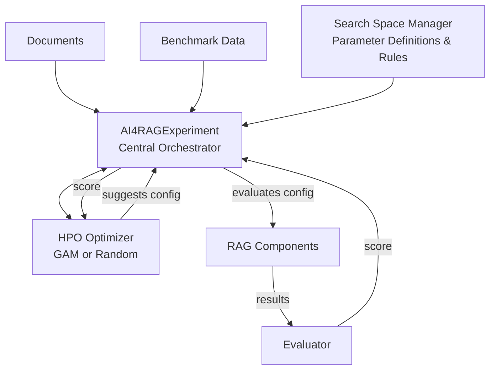
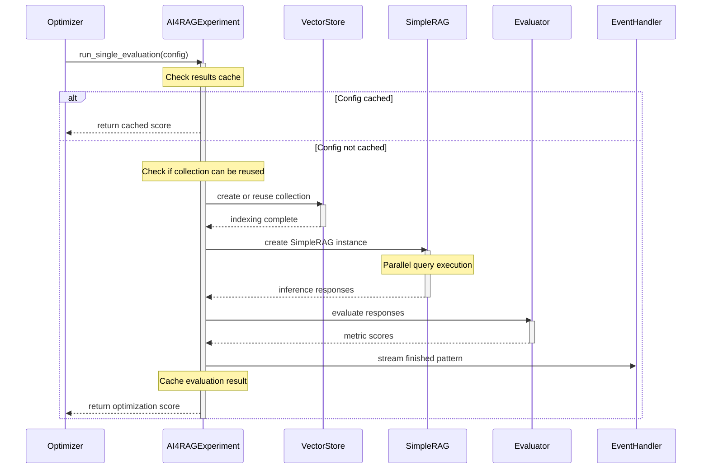
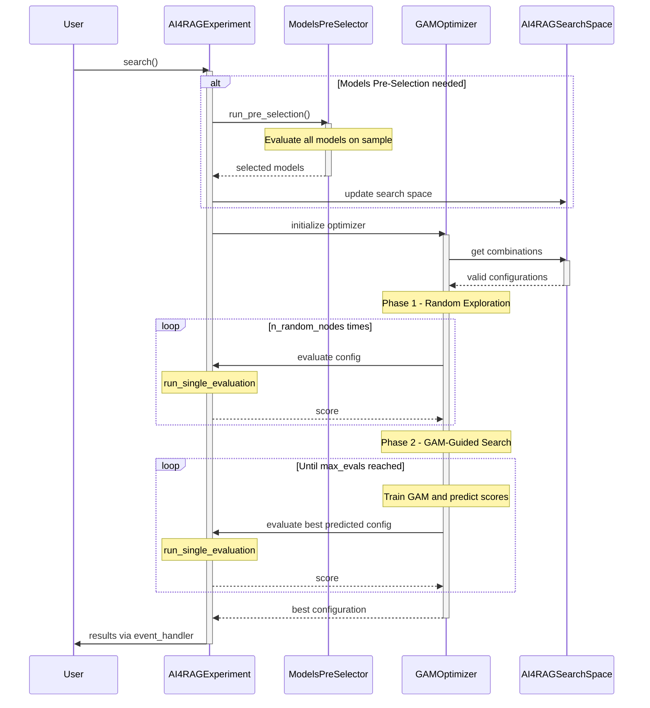

# Core Components

This page provides detailed architecture documentation for the core components that drive ai4rag's optimization engine.

---

## Architecture Overview

The core layer consists of three primary components working together to execute RAG hyperparameter optimization:



---

## Experiment Engine

### AI4RAGExperiment

The `AI4RAGExperiment` class is the central orchestrator for the entire optimization workflow. It coordinates between the optimizer, RAG components, evaluation, and result management.

**Key Responsibilities:**

- Manage experiment lifecycle (initialization, execution, cleanup)
- Coordinate HPO optimizer with RAG pattern evaluation
- Handle vector store collection reuse and caching
- Execute Models Pre-Selection (MPS) when needed
- Stream results via event handlers

**Core Workflow:**

```python
experiment = AI4RAGExperiment(
    documents=documents,
    benchmark_data=benchmark_data,
    search_space=search_space,
    vector_store_type="ogx",
    ogx_vector_io_provider_id="milvus",
    optimizer_settings=GAMOptSettings(max_evals=20),
    event_handler=my_handler,
    client=ogx_client,
)

experiment.search()  # Execute optimization
```

### search() Method

The `search()` method is the main entry point that executes the optimization loop:

1. **Models Pre-Selection (MPS)** (optional):
   - Triggered when `len(foundation_models) > n_mps_foundation_models` or `len(embedding_models) > n_mps_embedding_models`
   - Evaluates all model combinations on a small sample (default: 5 benchmark questions)
   - Selects top N models based on optimization metric
   - Reduces search space by eliminating poorly-performing models early
   - Can be skipped with `skip_mps=True` kwarg

2. **Optimizer Initialization**:
   - Creates optimizer instance (default: `GAMOptimizer`)
   - Passes `objective_function` wrapper that calls `run_single_evaluation()`
   - Optionally warm-starts with `known_observations`

3. **Optimization Loop**:
   - Optimizer suggests next configuration
   - `run_single_evaluation()` evaluates configuration
   - Score returned to optimizer
   - Loop continues until `max_evals` reached

4. **Error Handling**:
   - Failed iterations captured via `ExperimentExceptionHandler`
   - Continues optimization despite individual failures
   - Final error summary available if all iterations fail

### run_single_evaluation() Method

This method evaluates a single RAG configuration and returns its optimization score:



**Key Features:**

1. **Results Caching**: Checks if identical `indexing_params` + `rag_params` have been evaluated before
2. **Collection Reuse**: Reuses vector store collections when `indexing_params` match (chunking + embedding)
3. **Parallel Query Execution**: Uses `ThreadPoolExecutor` (max 10 threads) for concurrent question processing
4. **Event Streaming**: Notifies event handler at each step (chunking, embedding, retrieval, generation, evaluation)
5. **Error Handling**: Wraps errors in domain-specific exceptions (`IndexingError`, `GenerationError`, `EvaluationError`)

**Parameters Extracted:**

- **Chunking params**: `chunking_method`, `chunk_size`, `chunk_overlap`
- **Embedding params**: `model_id`, `distance_metric`, `embedding_dimension`, `context_length`
- **Retrieval params**: `retrieval_method`, `window_size`, `number_of_chunks`, `search_mode`, `ranker_*`
- **Generation params**: `model_id`, `context_template_text`, `user_message_text`, `system_message_text`

### Models Pre-Selection (MPS)

The `ModelsPreSelector` reduces the search space by evaluating all model combinations on a small benchmark sample:

```python
def run_pre_selection(
    self,
    foundation_models: list[BaseFoundationModel],
    embedding_models: list[BaseEmbeddingModel],
    n_records: int = 5,
    random_seed: int = 17,
) -> dict[str, list]:
```

**Process:**

1. Sample `n_records` questions from benchmark data (with `random_seed` for reproducibility)
2. Evaluate every `(foundation_model, embedding_model)` combination
3. Rank by `optimization_metric` performance
4. Select top `n_mps_foundation_models` and `n_mps_embedding_models`
5. Update search space with selected models

**Default Thresholds:**

- `n_mps_foundation_models = 3`
- `n_mps_embedding_models = 2`

**When to Use:**

- Large model search spaces (e.g., 10 foundation models × 5 embedding models = 50 combinations)
- Limited evaluation budget
- Want to eliminate clearly underperforming models early

---

## HPO Optimizers

All optimizers implement the `BaseOptimizer` interface and share common functionality:

### BaseOptimizer Interface

```python
class BaseOptimizer(ABC):
    def __init__(
        self,
        objective_function: Callable[[dict], float],
        search_space: SearchSpace,
        settings: OptimizerSettings,
    ):
        self.objective_function = objective_function
        self._search_space = search_space
        self.settings = settings

    @abstractmethod
    def search(self) -> dict[str, Any]:
        """Return best configuration with score."""
```

**Common Settings:**

```python
@dataclass
class OptimizerSettings:
    max_evals: int  # Maximum evaluations to perform
```

### GAMOptimizer

The **Generalized Additive Models (GAM)** optimizer is the recommended algorithm for ai4rag. It uses a two-phase approach:

**Phase 1: Random Exploration**

- Randomly evaluates `n_random_nodes` configurations from the search space
- Builds initial understanding of the objective function landscape
- Excludes already-evaluated combinations (important for warm-start)

**Phase 2: GAM-Guided Search**

- Trains a `LinearGAM` model on evaluated configurations
- Predicts scores for all remaining (unevaluated) configurations
- Selects top `evals_per_trial` configurations with highest predicted scores
- Evaluates selected configurations and updates training data
- Repeats until `max_evals` reached

**Settings:**

```python
@dataclass
class GAMOptSettings(OptimizerSettings):
    max_evals: int = 20            # Total evaluation budget
    n_random_nodes: int = 4         # Initial random evaluations
    evals_per_trial: int = 1        # Evaluations per GAM iteration
    random_state: int = 64          # Random seed for reproducibility
```

**Algorithm Details:**

```python
def search(self) -> dict[str, Any]:
    # Phase 1: Random exploration
    self.evaluate_initial_random_nodes()  # Evaluate n_random_nodes

    # Phase 2: GAM-guided search
    iterations_limit = ceil((max_evals - len(evaluations)) / evals_per_trial)
    for _ in range(iterations_limit):
        self._run_iteration()  # Train GAM, predict, evaluate best

    # Return best configuration
    return max(evaluations, key=lambda x: x["score"])
```

**GAM Iteration Details:**

1. **Encode categorical parameters** using `LabelEncoder` (one encoder per parameter)
2. **Train LinearGAM** on `(encoded_params, scores)` from successful evaluations
3. **Predict scores** for all remaining unevaluated configurations
4. **Select top N** configurations with highest predictions (N = `evals_per_trial`)
5. **Evaluate** selected configurations via `objective_function`
6. **Update** `evaluations` and `_evaluated_combinations`

**When to Use:**

- Medium to large search spaces (10+ combinations)
- Want intelligent exploration beyond random search
- Have evaluation budget for >4 evaluations

**Warm-Starting:**

```python
known_observations = [
    {"foundation_model": model_a, "chunk_size": 512, ..., "score": 0.72},
    {"foundation_model": model_b, "chunk_size": 1024, ..., "score": 0.68},
]

optimizer = GAMOptimizer(
    objective_function=objective_fn,
    search_space=search_space,
    settings=GAMOptSettings(max_evals=20, n_random_nodes=2),
    known_observations=known_observations,
)
```

- Pre-populates `evaluations` with known results
- Counts toward `n_random_nodes` target (may skip random phase entirely if enough known)
- Excludes known combinations from random sampling candidates

### RandomOptimizer

A simple baseline optimizer that performs pure random search:

```python
@dataclass
class RandomOptSettings(OptimizerSettings):
    max_evals: int  # Only setting needed
```

**Algorithm:**

1. Shuffle all search space combinations
2. Evaluate first `max_evals` combinations
3. Return best score

**When to Use:**

- Very small search spaces (<10 combinations)
- Benchmarking against smarter algorithms
- Sanity checking search space definitions

---

## Search Space Manager

The search space system defines the hyperparameter search space and validates configurations against rules.

### Parameter Class

Represents a single optimizable parameter with type-specific constraints:

```python
@dataclass(frozen=True)
class Parameter(Generic[HashableT]):
    name: str
    param_type: Literal["B", "I", "R", "C"]  # Boolean, Integer, Real, Categorical
    v_min: Optional[int | float] = None       # For I/R types
    v_max: Optional[int | float] = None       # For I/R types
    values: Optional[Sequence[HashableT]] = None  # For B/C types
```

**Parameter Types:**

| Type | Description | Required Fields | Example |
|------|-------------|----------------|---------|
| **C** (Categorical) | Fixed set of values | `values` | `values=["simple", "window"]` |
| **I** (Integer) | Integer range | `v_min`, `v_max` | `v_min=128, v_max=2048` |
| **R** (Real/Float) | Float range | `v_min`, `v_max` | `v_min=0.0, v_max=1.0` |
| **B** (Boolean) | True/False | `values` | `values=[True, False]` |

**Examples:**

```python
# Categorical parameter
Parameter(
    name=AI4RAGParamNames.RETRIEVAL_METHOD,
    param_type="C",
    values=["simple", "window"]
)

# Integer parameter
Parameter(
    name=AI4RAGParamNames.CHUNK_SIZE,
    param_type="I",
    v_min=128,
    v_max=2048
)

# Real parameter
Parameter(
    name=AI4RAGParamNames.RANKER_ALPHA,
    param_type="R",
    v_min=0.0,
    v_max=1.0
)

# Categorical with complex objects (models)
Parameter(
    name=AI4RAGParamNames.FOUNDATION_MODEL,
    param_type="C",
    values=[OGXFoundationModel(...), OGXFoundationModel(...)]
)
```

**Hashability:** Parameters are immutable (`frozen=True`) and hashable, enabling efficient comparison and caching. Complex categorical values (like model objects) are hashed for comparison.

### SearchSpace Base Class

Generic search space manager with rule-based filtering:

```python
class SearchSpace:
    def __init__(
        self,
        params: list[Parameter] = None,
        rules: list[RuleFunction] | None = None
    ):
        self.params = params or []
        self._rules = rules
```

**Key Properties:**

- **`combinations`**: All valid parameter combinations after applying rules
- **`max_combinations`**: Total count of valid combinations

**Rule Application:**

Rules are functions that filter invalid parameter combinations:

```python
RuleFunction: TypeAlias = Callable[[dict[str, Any]], bool]

def _rule_chunk_size_bigger_than_chunk_overlap(combination: dict) -> bool:
    chunk_size = combination.get("chunk_size")
    chunk_overlap = combination.get("chunk_overlap")
    return chunk_size > 2 * chunk_overlap
```

Rules are applied sequentially to all combinations; any combination failing any rule is removed.

### AI4RAGSearchSpace

Specialized search space for RAG optimization with built-in validation rules:

```python
class AI4RAGSearchSpace(SearchSpace):
    def __init__(
        self,
        params: list[Parameter] | None = None,
        rules: list[RuleFunction] | None = None,
        vector_store_type: str = "ogx",
        ogx_vector_io_provider_id: str = "milvus",
    ):
```

**Built-in Validation Rules:**

**Base Rules (always applied):**

1. **Chunk size > 2 × chunk overlap**
   - Ensures sufficient non-overlapping content
   - Skipped when `chunk_size == 0` (structural-only splitting)

2. **Window size ↔ retrieval method consistency**
   - `window_size == 0` requires `retrieval_method == "simple"`
   - `window_size > 0` requires `retrieval_method == "window"`

3. **Chunk size within embedding context length**
   - Estimates token count: `estimated_tokens = chunk_size / 3.6`
   - Verifies `estimated_tokens <= embedding_model.params.context_length`
   - Conservative ratio prevents runtime failures

**Hybrid Search Rules (only for `vector_store_type != "chroma"`):**

4. **Search mode ↔ ranker parameter consistency**
   - When `search_mode == "vector"`: all ranker params must be sentinels (`""`, `0`, `1`)
   - When `search_mode == "hybrid"`: `ranker_strategy` must be non-empty

5. **Ranker K for RRF only**
   - `ranker_k > 0` only when `ranker_strategy == "rrf"`
   - `ranker_k == 0` (sentinel) for all other strategies

6. **Ranker alpha for weighted only**
   - `ranker_alpha != 1` only when `ranker_strategy == "weighted"`
   - `ranker_alpha == 1` (sentinel, means 100% dense) for all other strategies

**Required Parameters:**

User must provide at minimum:

- `foundation_model` (Categorical)
- `embedding_model` (Categorical)

All other parameters have defaults that can be overridden.

**Custom Rules:**

Add your own validation logic:

```python
def _rule_small_chunks_for_qa(combination: dict) -> bool:
    """Prefer smaller chunks for Q&A tasks."""
    if combination.get("chunk_size", 0) > 1024:
        return False
    return True

search_space = AI4RAGSearchSpace(
    params=[...],
    rules=[_rule_small_chunks_for_qa]
)
```

**Combination Generation:**

```python
# Example: 2 models × 2 chunk sizes × 2 retrievals = 8 combinations
params = [
    Parameter(name="foundation_model", param_type="C", values=[model_a, model_b]),
    Parameter(name="chunk_size", param_type="C", values=[512, 1024]),
    Parameter(name="retrieval_method", param_type="C", values=["simple", "window"]),
]

search_space = AI4RAGSearchSpace(params=params)

# Generate Cartesian product, then filter via rules
combinations = search_space.combinations
# Returns: list of dicts, each dict is one valid configuration
```

---

## Component Interaction Flow



---

## Extension Points

The core components are designed for extensibility:

### Custom Optimizer

Implement `BaseOptimizer` for custom optimization algorithms:

```python
class CustomOptimizer(BaseOptimizer):
    def search(self) -> dict[str, Any]:
        # Your algorithm here
        pass
```

Use via `search()` kwargs:

```python
experiment.search(optimizer=CustomOptimizer)
```

### Custom Search Space Rules

Add domain-specific validation:

```python
def _rule_custom_constraint(combination: dict) -> bool:
    # Your validation logic
    return True

search_space = AI4RAGSearchSpace(
    params=params,
    rules=[_rule_custom_constraint]
)
```

### Custom Exception Handling

The `ExperimentExceptionHandler` can be extended to customize error handling behavior for failed iterations.

---

## Performance Considerations

**Collection Reuse:**
- Vector store collections are reused when `indexing_params` match
- Avoids re-embedding and re-indexing documents for identical chunking/embedding configs
- Significant speedup when search space varies only retrieval/generation params

**Results Caching:**
- Identical `(indexing_params, rag_params)` combinations return cached scores
- Prevents redundant evaluation when optimizer suggests same config twice

**Parallel Query Execution:**
- `ThreadPoolExecutor` with max 10 threads for concurrent question processing
- Balances throughput with server load
- Configurable via `max_threads` in `query_rag()`

**Batch Embedding:**
- OGXEmbeddingModel processes documents in batches of 2048 chunks
- Prevents API request size limits
- Applied in both indexing and query phases

**GAM Efficiency:**
- Uses `sklearn.preprocessing.LabelEncoder` for categorical parameter encoding
- Encodes once per search, reused for all iterations
- LinearGAM training is fast even for large search spaces (100s of combinations)

---

## Best Practices

1. **Start with MPS**: Let Models Pre-Selection eliminate poor models early when evaluating many model combinations

2. **Use GAMOptimizer**: Better than random search for search spaces with >10 combinations

3. **Warm-start when possible**: Reuse previous experiment results via `known_observations`

4. **Define focused search spaces**: Constrain parameter ranges based on domain knowledge to reduce search space size

5. **Monitor via event handlers**: Implement custom `BaseEventHandler` to track progress and debug issues

6. **Leverage collection reuse**: Structure search space to maximize indexing parameter reuse (e.g., vary only retrieval params)

---

## Next Steps

- [Data Flow](data-flow.md) - Detailed workflow analysis
- [RAG Components](rag-components.md) - RAG pipeline component details
- [Architecture Overview](overview.md) - High-level design
