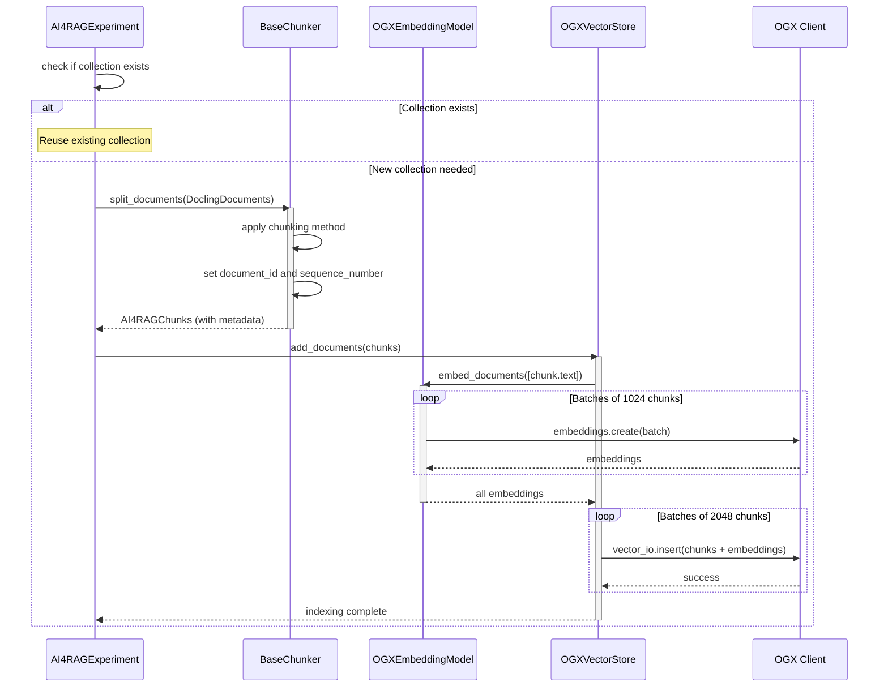
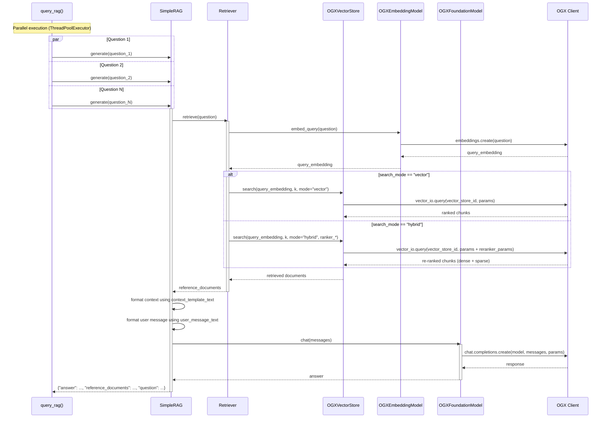
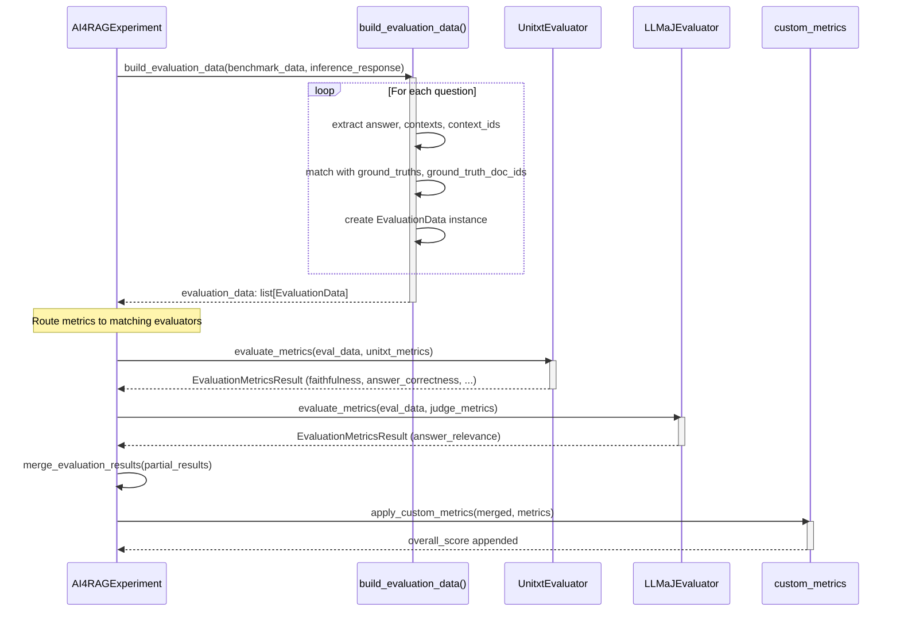
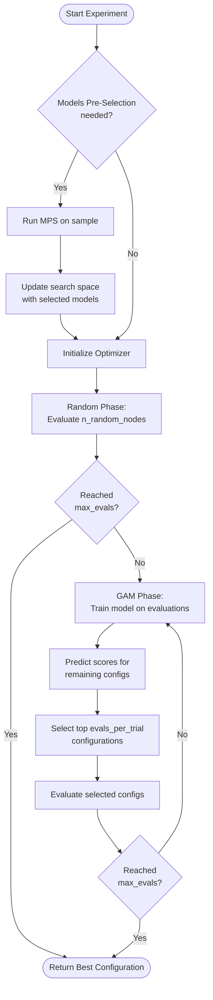

# Data Flow

This page provides a detailed analysis of how data flows through the ai4rag system during optimization, from documents to optimal RAG configuration.

---

## Overview

ai4rag's data flow consists of four distinct phases executed for each configuration evaluated during hyperparameter optimization:

1. **Indexing Phase**: Documents → Chunks → Embeddings → Vector Store
2. **Query Phase**: Question → Retrieval → Context → Generation → Answer
3. **Evaluation Phase**: Answers + Ground Truth → Metrics → Scores
4. **Optimization Loop**: Scores → Optimizer → Next Configuration

---

## Indexing Phase

The indexing phase transforms raw documents into searchable vector embeddings stored in a vector database.



### Document Processing

**Input Documents:**

Documents are provided as `list[DoclingDocument]` (from the `docling-core` library). Each document is a structured representation of a parsed file, with the document name used as `document_id`. If the name is not set, a content-based hash is generated instead.

### Chunking

The configured chunker (`DoclingChunker` or `LangChainChunker`) splits `DoclingDocument` objects into `AI4RAGChunk` instances. Both chunkers use a character-based token approximation (4 characters = 1 token) for token counting.

**DoclingChunker** (structure-aware): Operates directly on the document structure, preserving headings and tables. Does not support overlap.

**LangChainChunker** (token-based): Converts each `DoclingDocument` to markdown internally, then applies `RecursiveCharacterTextSplitter` with token-based length measurement.

**Metadata:**

Each chunk receives:

```python
AI4RAGChunk(
    text="Chunk text content...",
    metadata={
        "document_id": "original_doc_id",    # From document name or content hash
        "sequence_number": 1,                 # Position within document
        # chunker-specific keys (e.g. "start_index" for LangChain, "headings" for Docling)
    }
)
```

**Sequence numbering:**
- Sequence numbers assigned sequentially per document
- Enables window-based retrieval (adjacent chunks)

**Output:**

```python
[
    AI4RAGChunk(
        text="First chunk text...",
        metadata={"document_id": "doc1", "sequence_number": 1}
    ),
    AI4RAGChunk(
        text="Second chunk text...",
        metadata={"document_id": "doc1", "sequence_number": 2}
    ),
    # ...
]
```

### Embedding

**OGXEmbeddingModel** converts chunk text to vector embeddings:

**Auto-detection (on first use):**

```python
embedding_model = OGXEmbeddingModel(
    model_id="ollama/nomic-embed-text:latest",
    client=ogx_client,
    params={"embedding_dimension": 768, "context_length": 8192}  # Optional
)
```

If `embedding_dimension` or `context_length` not provided:
- `embedding_dimension`: Detected via test embedding call (counts dimensions)
- `context_length`: Detected via binary search (64 to 8192 tokens, ~5 API calls)

**Batch Processing:**

Embeddings created in batches of 1024 chunks to respect API limits:

```python
def embed_documents(texts: list[str]) -> list[list[float]]:
    embeddings = []
    for idx in range(0, len(texts), 1024):
        batch = texts[idx : idx + 1024]
        batch_embeddings = self.client.embeddings.create(
            input=batch,
            model=self.model_id
        )
        embeddings.extend([data.embedding for data in batch_embeddings.data])
    return embeddings
```

**Output:**

```python
[
    [0.023, -0.145, 0.678, ...],  # 768-dimensional vector for chunk 1
    [0.091, -0.023, 0.445, ...],  # 768-dimensional vector for chunk 2
    # ...
]
```

### Vector Store Insertion

**OGXVectorStore** stores chunks and embeddings in OGX vector database:

**Collection Creation:**

```python
vs = client.vector_stores.create(
    extra_body={
        "provider_id": "milvus",  # From ogx_vector_io_provider_id="milvus"
        "embedding_model": "ollama/nomic-embed-text:latest",
        "embedding_dimension": 768,
    }
)
collection_name = vs.id  # Unique collection ID
```

**Batch Insertion:**

Chunks inserted in batches of 2048:

```python
chunks = [
    {
        "content": chunk.text,
        "chunk_metadata": chunk.metadata,
        "chunk_id": chunk.metadata["document_id"],
        "embedding_model": embedding_model.model_id,
        "embedding_dimension": 768,
        "embedding": embedding_vector,
    }
    for chunk, embedding_vector in zip(chunks, embeddings)
]

for idx in range(0, len(chunks), 2048):
    client.vector_io.insert(
        vector_store_id=collection_name,
        chunks=chunks[idx : idx + 2048]
    )
```

### Collection Reuse

**Key Optimization:** Collections are reused when `indexing_params` match:

```python
indexing_params = {
    "chunking": {
        "chunking_method": "recursive",
        "chunk_size": 512,
        "chunk_overlap": 128,
    },
    "embedding": {
        "model_id": "ollama/nomic-embed-text:latest",
        "distance_metric": "cosine",
        "embedding_dimension": 768,
        "context_length": 8192,
    }
}
```

**Reuse Logic:**

1. Hash `indexing_params` to generate canonical representation
2. Check `results.collection_names` for matching params
3. If match found, reuse `collection_name` (skip chunking, embedding, insertion)
4. If no match, create new collection

**Performance Impact:**

- Avoids re-chunking and re-embedding when only retrieval/generation params change
- Typical speedup: 50-80% per evaluation when collection reused

---

## Query Phase

The query phase retrieves relevant chunks and generates answers for benchmark questions.



### Parallel Query Execution

**ThreadPoolExecutor** processes benchmark questions concurrently:

```python
def query_rag(
    rag: BaseRAGTemplate,
    questions: list[str],
    max_threads: int = 10
) -> list[dict]:

    with ThreadPoolExecutor(max_workers=max_threads) as executor:
        responses = list(executor.map(
            partial(_generate_response, rag=rag),
            questions
        ))
    return responses
```

**Concurrency:**
- Default: 10 concurrent threads
- Balances throughput with server load
- Each thread executes full retrieval + generation pipeline independently

### Retrieval

**Retriever** fetches relevant chunks from the vector store:

**Step 1: Embed Query**

```python
query_embedding = embedding_model.embed_query(question)
# Returns: [0.123, -0.456, 0.789, ...]  (same dimension as document embeddings)
```

**Step 2: Vector Search**

**Vector Mode (semantic search only):**

```python
params = {
    "max_chunks": 5,  # number_of_chunks
    "mode": "vector"
}
response = client.vector_io.query(
    query=question,
    vector_store_id=collection_name,
    params=params
)
```

Returns top-k chunks by cosine similarity (or other distance metric).

**Hybrid Mode (semantic + keyword):**

```python
params = {
    "max_chunks": 5,
    "mode": "hybrid",
    "reranker_type": "rrf",  # or "weighted", "normalized"
    "reranker_params": {
        "k": 60  # ranker_k for RRF
        # or "alpha": 0.7 for weighted
    }
}
response = client.vector_io.query(...)
```

Combines dense vector search with sparse keyword search (e.g., BM25), then re-ranks using specified strategy.

**Step 3: Convert to AI4RAGChunks**

```python
reference_documents = [
    AI4RAGChunk(
        text=chunk.content,
        metadata=chunk.chunk_metadata.to_dict()
    )
    for chunk in response.chunks
]
```

### Context Formatting

**SimpleRAG** formats retrieved chunks into LLM context:

```python
# Default context_template_text: "{document}\n"
context = "\n".join([
    foundation_model.context_template_text.format(document=chunk.text)
    for chunk in reference_documents
])
```

**Example output:**

```
According to the document: "First retrieved chunk text..."

According to the document: "Second retrieved chunk text..."

...
```

**Customization:**

```python
foundation_model = OGXFoundationModel(
    model_id="ollama/llama3.2:3b",
    client=client,
    context_template_text="Source {document}\n---\n"  # Custom format
)
```

### User Message Construction

Combine context with question:

```python
# Default user_message_text:
# "{reference_documents}\n\nQuestion: {question}\nAnswer:"

user_message = foundation_model.user_message_text.format(
    reference_documents=context,
    question=question
)
```

**Example output:**

```
According to the document: "Chunk 1..."

According to the document: "Chunk 2..."

Question: What is the capital of France?
Answer:
```

### Generation

**OGXFoundationModel** generates answer via chat completion:

```python
messages = [
    {
        "role": "system",
        "content": foundation_model.system_message_text
        # Default: "You are a helpful, respectful and honest assistant..."
    },
    {
        "role": "user",
        "content": user_message
    }
]

response = client.chat.completions.create(
    model=foundation_model.model_id,
    messages=messages,
    max_completion_tokens=1024,
    temperature=0.1
)

answer = response.choices[0].message.content
```

**Output:**

```python
{
    "answer": "Based on the provided documents, Paris is the capital of France.",
    "reference_documents": [Document(...), Document(...), ...],
    "question": "What is the capital of France?"
}
```

---

## Evaluation Phase

The evaluation phase compares generated answers against ground truth using multiple evaluator types and merges results.



### EvaluationData Assembly

**build_evaluation_data()** combines inference results with benchmark data:

**Input: inference_response**

```python
[
    {
        "question": "What is X?",
        "answer": "Based on the documents, X is...",
        "reference_documents": [Document(...), Document(...)]
    },
    # ... one per benchmark question
]
```

**Input: benchmark_data**

```python
BenchmarkData with:
- questions: ["What is X?", ...]
- correct_answers: [["X is...", "Alternative answer"], ...]
- document_ids: [["doc1", "doc3"], ...]  # Ground truth source docs
- questions_ids: ["q0", "q1", ...]
```

**Output: EvaluationData list**

```python
[
    EvaluationData(
        question="What is X?",
        answer="Based on the documents, X is...",
        contexts=[
            "Retrieved chunk 1 text...",
            "Retrieved chunk 2 text..."
        ],
        context_ids=["doc1", "doc1"],  # Source document IDs
        ground_truths=["X is...", "Alternative answer"],
        ground_truths_context_ids=["doc1", "doc3"],
        question_id="q0"
    ),
    # ...
]
```

### Unitxt Evaluation

**UnitxtEvaluator** wraps the unitxt library for metric computation:

**Metrics Evaluated:**

| ai4rag Metric | Unitxt Metric | Description |
|---------------|---------------|-------------|
| `faithfulness` | `metrics.rag.external_rag.faithfulness` | How well is the answer grounded in retrieved context? |
| `answer_correctness` | `metrics.rag.external_rag.answer_correctness` | How correct is the answer vs ground truth? |
| `context_correctness` | `metrics.rag.external_rag.context_correctness` | How relevant are retrieved docs vs ground truth docs? |

**Evaluation Process:**

1. **Convert to DataFrame**:

```python
df = pd.DataFrame([data.to_dict() for data in evaluation_data])
```

2. **Call unitxt.evaluate()**:

```python
scores_df, ci_table = evaluate(
    df,
    metric_names=[
        "metrics.rag.external_rag.faithfulness",
        "metrics.rag.external_rag.answer_correctness",
        "metrics.rag.external_rag.context_correctness"
    ],
    compute_conf_intervals=True
)
```

3. **Extract Aggregate Scores** (mean + confidence intervals):

```python
{
    "faithfulness": {
        "mean": 0.72,
        "ci_low": 0.61,
        "ci_high": 0.83
    },
    "answer_correctness": {
        "mean": 0.68,
        "ci_low": 0.55,
        "ci_high": 0.81
    },
    "context_correctness": {
        "mean": 0.80,
        "ci_low": 0.70,
        "ci_high": 0.90
    }
}
```

4. **Extract Per-Question Scores**:

```python
{
    "faithfulness": {
        "q0": 0.71,
        "q1": 0.73,
        "q2": 0.68,
        ...
    },
    "answer_correctness": {
        "q0": 0.65,
        "q1": 0.70,
        ...
    },
    ...
}
```

### Optimization Score Calculation

The final optimization score is extracted from the aggregate results:

```python
optimization_metric = "overall_score"  # Default; user-configurable
final_score = next(
    m["scores"]["mean"] for m in result_scores["metrics"]
    if m["name"] == optimization_metric
)
# Example: 0.75
```

This single scalar value is returned to the optimizer.

---

## Optimization Loop

The optimization loop iterates configurations until the evaluation budget is exhausted.



### Iteration Details

Each optimizer iteration follows this flow:

**Random Phase (GAMOptimizer only):**

```python
def evaluate_initial_random_nodes():
    successful = count(evaluations where score is not None)

    while successful < n_random_nodes and len(evaluations) < max_evals:
        config = random.choice(unevaluated_combinations)
        score = objective_function(config)  # Calls run_single_evaluation()
        evaluations.append({"config": config, "score": score})
        if score is not None:
            successful += 1
```

**GAM Phase:**

```python
def _run_iteration():
    # 1. Train GAM
    successful_evals = [e for e in evaluations if e["score"] is not None]
    X_train = encode_categorical_params(successful_evals)
    y_train = [e["score"] for e in successful_evals]
    gam = LinearGAM().fit(X_train, y_train)

    # 2. Predict
    remaining = get_unevaluated_configs()
    X_predict = encode_categorical_params(remaining)
    predictions = gam.predict(X_predict)

    # 3. Select top N
    ranked = sorted(
        zip(remaining, predictions),
        key=lambda x: x[1],
        reverse=True  # Highest predictions first
    )
    top_n = ranked[:evals_per_trial]

    # 4. Evaluate
    for config, predicted_score in top_n:
        actual_score = objective_function(config)
        evaluations.append({"config": config, "score": actual_score})
```

### Results Caching

**Two-level caching prevents redundant work:**

**Level 1: Results Cache (entire evaluation)**

```python
def results.evaluation_explored_or_cached(indexing_params, rag_params) -> float | None:
    cache_key = hash((indexing_params, rag_params))
    if cache_key in cached_evaluations:
        return cached_evaluations[cache_key]["final_score"]
    return None
```

If exact `(indexing_params, rag_params)` evaluated before, return cached score immediately.

**Level 2: Collection Reuse (indexing only)**

```python
def results.get_existing_collection(indexing_params) -> str | None:
    cache_key = hash(indexing_params)
    if cache_key in existing_collections:
        return existing_collections[cache_key]["collection_name"]
    return None
```

If `indexing_params` match but `rag_params` differ, reuse collection (skip indexing, but re-run retrieval/generation/evaluation).

**Cache Hit Rates:**

- Full cache hit: ~1% of time (optimizer rarely suggests exact duplicate)
- Collection reuse: ~40-60% of time (common when varying only retrieval/generation params)

### Event Streaming

Throughout the loop, **event handlers** receive status updates and results:

**on_status_change() calls:**

```python
# Chunking
event_handler.on_status_change(
    level=LogLevel.INFO,
    message="Chunking documents using recursive method...",
    step=ExperimentStep.CHUNKING
)

# Embedding
event_handler.on_status_change(
    level=LogLevel.INFO,
    message="Embedding chunks using ollama/nomic-embed-text:latest...",
    step=ExperimentStep.EMBEDDING
)

# Generation
event_handler.on_status_change(
    level=LogLevel.INFO,
    message="Retrieval and generation using collection 'xyz'...",
    step=ExperimentStep.GENERATION
)

# Evaluation
event_handler.on_status_change(
    level=LogLevel.INFO,
    message="Evaluating RAG Pattern 'Pattern5'...",
    step="evaluation"
)
```

**on_pattern_creation() calls:**

After each evaluation completes:

```python
event_handler.on_pattern_creation(
    payload={
        "name": "Pattern5",
        "iteration": 4,
        "max_combinations": 24,
        "duration_seconds": 134,
        "evaluation": {
            "metrics": [
                {"name": "faithfulness", "evaluator": "unitxt", "description": "...",
                 "scores": {"mean": 0.72, "ci_low": 0.61, "ci_high": 0.83}},
                {"name": "overall_score", "evaluator": "custom", "description": "...",
                 "scores": {"mean": 0.75, ...}, "optimization_metric": True},
            ],
        },
        "settings": {
            "chunking": {...},
            "embedding": {...},
            "retrieval": {...},
            "generation": {...},
            "vector_store_binding": {...},
        },
    },
    evaluation_results=[
        {"question": ..., "answer": ..., "metrics": [
            {"name": "faithfulness", "evaluator": "unitxt", "score": 0.71}, ...
        ]},
        ...
    ],
)
```

---

## Performance Optimizations

### 1. Parallel Query Execution

**Impact:** 5-10x speedup for query phase

**Implementation:**

```python
with ThreadPoolExecutor(max_workers=10) as executor:
    responses = list(executor.map(generate_fn, questions))
```

**Trade-offs:**
- More threads = higher throughput but more server load
- 10 threads balances throughput with API rate limits

### 2. Batch Embedding

**Impact:** 2-3x speedup for indexing phase

**Implementation:**

```python
for idx in range(0, len(texts), 1024):
    batch = texts[idx : idx + 1024]
    embeddings.extend(embed_batch(batch))
```

**Constraints:**
- OGX max batch size: 1024 chunks
- Smaller batches = more API calls = slower

### 3. Collection Reuse

**Impact:** 50-80% speedup when indexing params unchanged

**Cache Key:**

```python
cache_key = hash((
    chunking_method,
    chunk_size,
    chunk_overlap,
    embedding_model_id,
    embedding_dimension
))
```

**Reuse Rate:**
- Typical search spaces: 40-60% reuse
- Search spaces varying only retrieval/generation: 80-95% reuse

### 4. Results Caching

**Impact:** Instant return for duplicate evaluations

**Frequency:**
- Random optimizer: ~0-1% hit rate (no duplicates by design)
- GAM optimizer: ~1-5% hit rate (rare duplicate suggestions)

### 5. Early Stopping (Models Pre-Selection)

**Impact:** 30-70% reduction in total evaluations

**Example:**
- Without MPS: 10 models × 5 embeddings × 4 configs = 200 evaluations
- With MPS: 3 models × 2 embeddings × 4 configs = 24 evaluations (88% reduction)

---

## Data Transformations Summary

**Documents → Chunks:**

```python
DoclingDocument(name="doc1", ...)
↓ (DoclingChunker or LangChainChunker)
[
    AI4RAGChunk(text="Chunk 1", metadata={"document_id": "doc1", "sequence_number": 1}),
    AI4RAGChunk(text="Chunk 2", metadata={"document_id": "doc1", "sequence_number": 2}),
    ...
]
```

**Chunks → Embeddings:**

```python
["Chunk 1 text", "Chunk 2 text", ...]
↓ (OGXEmbeddingModel)
[[0.1, -0.2, ...], [0.3, 0.1, ...], ...]  # 768-dim vectors
```

**Embeddings → Vector Store:**

```python
[{"content": "Chunk 1", "embedding": [0.1, ...], "metadata": {...}}, ...]
↓ (OGXVectorStore.add_documents)
Collection "xyz" in OGX vector DB
```

**Question → Query Embedding:**

```python
"What is the capital of France?"
↓ (OGXEmbeddingModel.embed_query)
[0.05, -0.12, 0.34, ...]  # 768-dim vector
```

**Query → Retrieved Chunks:**

```python
[0.05, -0.12, ...]
↓ (OGXVectorStore.search via vector_io.query)
[
    AI4RAGChunk(text="Paris is the capital...", metadata={...}),
    AI4RAGChunk(text="France's capital city...", metadata={...}),
    ...
]
```

**Chunks + Question → Answer:**

```python
contexts = ["Paris is the capital...", "France's capital city..."]
question = "What is the capital of France?"
↓ (SimpleRAG.generate via OGXFoundationModel.chat)
"Based on the provided documents, Paris is the capital of France."
```

**Answer + Ground Truth → Scores:**

```python
{
    "question": "What is the capital of France?",
    "answer": "Paris is the capital of France.",
    "ground_truths": ["Paris"],
    "contexts": [...],
    "ground_truths_context_ids": [...]
}
↓ (Multi-Evaluator Dispatch → merge → custom metrics)
{
    "metrics": [
        {"name": "faithfulness", "evaluator": "unitxt", ...,
         "scores": {"mean": 0.95, "ci_low": 0.90, "ci_high": 1.0}},
        {"name": "answer_relevance", "evaluator": "judge", ...,
         "scores": {"mean": 0.92, "ci_low": 0.85, "ci_high": 0.98}},
        {"name": "overall_score", "evaluator": "custom", ...,
         "scores": {"mean": 0.91, ...}},
    ],
    "question_scores": [...]
}
```

---

## Error Handling

**Failed Iterations:**

When an evaluation fails, the optimizer continues:

```python
try:
    score = run_single_evaluation(config)
except AI4RAGError as err:
    exception_handler.handle_exception(err)
    raise FailedIterationError(msg) from err
```

**In optimizer:**

```python
try:
    score = objective_function(config)
except FailedIterationError:
    score = None  # Don't penalize, just skip

evaluations.append({"config": config, "score": score})
```

**Result:** Failed evaluations don't stop optimization but don't contribute to GAM training.

**Common Failures:**

- **IndexingError**: Embedding API timeout, vector store connection issue
- **GenerationError**: LLM API error, rate limit exceeded
- **EvaluationError**: Malformed unitxt data, metric computation failure

---

## Next Steps

- [Core Components](core-components.md) - Detailed component documentation
- [RAG Components](rag-components.md) - RAG pipeline component details
- [Architecture Overview](overview.md) - High-level design
