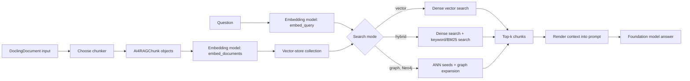

# Indexing and Search Lifecycle

This page describes how an `AI4RAGExperiment` turns converted source documents into a reusable index, retrieves evidence for a question, and generates an answer. It describes the current implementation, not a suggested configuration.

## End-to-end flow

Document conversion is upstream of this flow. The experiment receives `DoclingDocument` instances, rather than original PDF, Office, HTML, or image files. See [Pipeline Components](../user-guide/pipeline-components.md) for the extraction stage.

## Building an index

`AI4RAGExperiment.run_single_evaluation()` derives two independent parameter groups from a candidate RAG configuration:

- **Indexing parameters**: chunking method, chunk size, chunk overlap, embedding model ID, and embedding-model parameters.
- **Retrieval and generation parameters**: retrieval mode, result count, hybrid ranker settings, foundation-model settings, and prompt templates.

The distinction matters during optimization: changing only retrieval or generation settings should not cause the corpus to be embedded again.

### 1. Reuse or create a collection

Before indexing, the experiment searches its completed results for a collection built with identical indexing parameters. If one exists, it is reused. Otherwise, a new `ai4rag_*` collection is created. Collection names are deliberately namespaced so ai4rag does not accidentally modify unrelated database objects.

For Neo4j graph retrieval, the reuse key additionally includes the foundation-model identity, selected generation parameters, and knowledge-graph extraction configuration. Graph contents depend on LLM extraction, so an embedding-only key would be insufficient.

### 2. Chunk documents

The selected chunking method determines the chunks that are embedded:

| Method | Implementation | Behavior |
|---|---|---|
| `recursive` | `LangChainChunker` | Exports every `DoclingDocument` to Markdown and splits it recursively on paragraph, sentence, newline, word, and character boundaries. Chunk size and overlap use a four-characters-per-token approximation. |
| `hybrid` | `DoclingChunker` / Docling `HybridChunker` | Works on the structured `DoclingDocument`, respects document hierarchy, and can include headings in the chunk text. It uses a token ceiling; the `chunk_overlap` parameter is not used by this chunker. |

Each result is an `AI4RAGChunk` with at least `document_id` and `sequence_number` metadata. Its ID is a deterministic SHA-256 digest of document ID, sequence number, and text. This gives repeated indexing a stable primary key and lets stores safely upsert chunks rather than create duplicates.

### 3. Embed and write chunks

The vector store sends the chunk texts to `embedding_model.embed_documents()`, removes duplicate chunk IDs within the input batch, and writes the vector, text, metadata, and ID. The storage implementation then determines the physical index:

| Backend | Data written | Search indexes |
|---|---|---|
| Milvus / Milvus Lite | Chunk ID, text, JSON metadata, dense embedding, and a sparse BM25 representation derived from the text | FLAT cosine dense index and sparse inverted BM25 index. |
| PostgreSQL + pgvector | Chunk ID, JSONB metadata, dense embedding, original text, and a `tsvector` value | HNSW dense index and GIN full-text index. They are created lazily on first search, after bulk loading, to avoid per-row HNSW maintenance during indexing. If the embedding dimension exceeds pgvector's indexable limit, dense search falls back to an exact sequential scan while the GIN index remains available. |
| Neo4j | Document and chunk nodes, chunk embeddings, metadata, `CONTAINS` links, and `NEXT_CHUNK` links | A collection-scoped vector index. When knowledge-graph extraction is enabled, entity and relationship data is also written and linked to canonical chunks. |

The index-build cost is therefore driven principally by document conversion (when applicable), chunk count, embedding requests, and backend writes. For Neo4j graph retrieval, LLM-based entity/relationship extraction is an additional indexing cost.

## Performing a search

`SimpleRAG.generate(question)` calls `Retriever.retrieve(question)`. The retriever forwards the configured result count and search settings to the vector store, then returns the selected `AI4RAGChunk` objects.

### Dense vector mode

For `search_mode="vector"`:

1. The embedding model turns the question into one query vector with `embed_query()`.
2. The backend returns the `k` closest chunk vectors using its configured distance metric.
3. The chunks are returned in relevance order.

This is the lowest-overhead retrieval path: one embedding request and one dense search request. It is a strong default for semantic questions whose wording differs from the source material.

### Hybrid mode

For `search_mode="hybrid"`, ai4rag performs dense semantic search and keyword/full-text search, then combines their rankings:

- **Milvus** sends a dense request and a sparse BM25 request to the server. Milvus fuses them server-side with weighted ranking when `ranker_strategy="weighted"`; otherwise it uses reciprocal-rank fusion (RRF).
- **PGVector** embeds the query, runs the dense and PostgreSQL full-text queries concurrently, then fuses the two score maps in memory. The available strategies are RRF, weighted blending, and normalized blending.

The trade-off is one additional search leg and ranking work in exchange for better handling of rare terms, identifiers, product names, and exact phrases. `ranker_alpha` controls the dense-versus-keyword contribution for weighted ranking; `ranker_k` controls RRF smoothing.

### Graph mode

`search_mode="graph"` is Neo4j-specific. It starts with vector-search seed chunks, then can expand through entities, relationships, and adjacent chunk links. Its retrieval key includes knowledge-graph configuration because graph content is part of the index. It is useful when evidence is distributed across connected chunks, but it has higher indexing and query cost than dense-only retrieval.

### Prompt construction and answer generation

For every retrieved chunk, `SimpleRAG` renders `context_template_text` and joins the rendered chunks into `reference_documents`. It renders `user_message_text` with those references and the question, prepends `system_message_text`, and sends the messages to the foundation model.

During experiment evaluation, questions are submitted concurrently by `query_rag()` up to `inference_max_threads`. This parallelism applies to the complete per-question path: query embedding, retrieval, prompt construction, and foundation-model generation. PostgreSQL pool capacity is raised to at least that concurrency for the evaluation run.

## Speed and balanced pipelines

There is **no production `speed` or `balanced` pipeline preset in the current codebase**. The default search space is shared by all experiments and currently explores:

- recursive and hybrid chunking;
- chunk sizes 512, 1024, and 2048;
- overlaps 0, 128, and 256 (relevant to recursive chunking);
- 3, 5, or 10 retrieved chunks;
- vector and hybrid search for Milvus and PGVector; and
- applicable hybrid rankers and their parameters.

Consequently, selecting a “speed” or “balanced” label outside this repository does not change the implemented index-building or search behavior unless the caller translates that label into concrete search-space and concurrency values.

If profiles are added later, the following is the meaningful distinction they should encode:

| Concern | Speed-oriented profile | Balanced quality/cost profile |
|---|---|---|
| Chunking | Larger recursive chunks and little/no overlap, to produce fewer embeddings | Evaluate recursive and structure-aware hybrid chunking with moderate chunk sizes and overlap where relevant |
| Retrieval | Dense-only search with a small `number_of_chunks` | Include hybrid search and enough chunks to improve recall without overfilling the LLM context |
| Graph retrieval | Disabled | Optional, only when connected evidence justifies its extra indexing and query work |
| Model selection | Fewer candidate models and fewer optimizer evaluations | Broader search space and evaluation budget |
| Inference | Lower `inference_max_threads` when services are capacity-bound | Tune concurrency to available model and vector-store capacity |

These are tuning recommendations, not hidden behavior. Actual runtime behavior is determined by the submitted search space, vector-store configuration, model choices, and `inference_max_threads`.

## Practical implications

- Keep chunking and embedding parameters stable when comparing retrieval or prompt changes; that allows collection reuse and avoids repeated embedding cost.
- Use vector search first when semantic matching is sufficient and latency is important.
- Benchmark hybrid search on corpora containing exact technical terms or identifiers; it adds work but often improves recall.
- Treat `number_of_chunks` as both a retrieval-quality and generation-cost parameter: more chunks may improve evidence coverage but consume more prompt tokens.
- Pre-build and retain collections for repeated inference workloads rather than relying on the experiment loop to construct a new collection.
