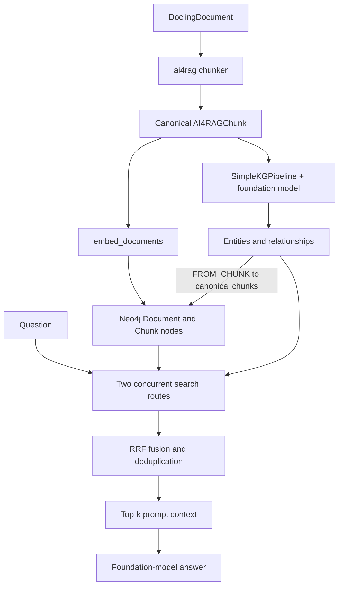
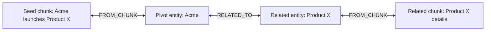

# Neo4j Indexing and Graph Search

This page describes the implemented Neo4j paths from collection creation to retrieval and cleanup.
`Neo4jGraphStore` accepts only `search_mode="graph"`.
That mode still uses vector search internally: one route returns vector matches directly, and another expands vector matches through the graph.

## Prerequisites

`Neo4jConfig` provides the URI, credentials, and database.
It can also read `NEO4J_URI`, `NEO4J_USERNAME`, `NEO4J_PASSWORD`, and `NEO4J_DATABASE`.

Indexing needs an embedding model; search uses it to embed queries.
Knowledge graph extraction also needs a foundation model.
The Neo4j GraphRAG pipeline uses APOC for relationship writes and entity resolution, so the configured database must have the procedures it calls available.
GraphRAG writer setup, node and relationship writes, and temporary-ID cleanup all target `Neo4jConfig.database`, including when it differs from the driver's default database.

## End-to-end flow



`AI4RAGExperiment.run_single_evaluation()` performs this flow for a new collection.
It passes its foundation model into `Neo4jGraphStore`, so `add_documents()` also extracts a graph after storing canonical chunks.
When the experiment reuses a completed collection, it skips indexing.

## Index construction

### Collection reuse and indexes

For Neo4j, the experiment's collection-reuse key includes chunking settings, embedding model and parameters, foundation-model ID, temperature, maximum completion tokens, and `kg_extraction_config`.
The foundation-model and KG settings are part of the key because they change the extracted graph even when the chunk embeddings are identical.

If no exact match exists, ai4rag creates a namespaced `ai4rag_*` collection.
`Neo4jGraphStore` verifies connectivity and creates one collection-scoped cosine vector index with `IF NOT EXISTS`:

- `{collection}__embedding` for chunk embeddings.

The index targets the collection label.
That label isolates ANN seed retrieval; graph expansion also filters by the `collection` property.
In the `add_documents()` workflow, both persistent `Document` nodes and canonical `Chunk` nodes receive the collection label; only chunks enter this vector index.

### Canonical chunks

| Method | Implementation | Behavior |
| --- | --- | --- |
| `recursive` | `LangChainChunker` | Markdown is recursively split; size and overlap use ai4rag's token-to-character approximation. |
| `hybrid` | `DoclingChunker` | Structured Docling content is split with a token ceiling; its overlap setting is unused. |

Each `AI4RAGChunk` has deterministic identity plus `document_id` and `sequence_number`.
`add_documents()` embeds all input text in one `embed_documents()` call, deduplicates chunk IDs, groups chunks by document, sorts each group by sequence number, and writes groups in transactions.
The default transaction threshold is 512 chunks.

```text
(:<collection>:Document {id, source, metadata})
    -[:CONTAINS]->
(:<collection>:Chunk {
    id, text, embedding, document_id, sequence_number, metadata, collection
})
```

Consecutive chunks receive `NEXT_CHUNK` relationships.
They preserve document order, but current graph retrieval does not traverse them.

The Neo4j default search space fixes chunk size at `1024`, explores overlap `0` and `64`, and fixes the mode to `graph`.
The chunking rules require a positive overlap for `recursive` and zero overlap for `hybrid`, leaving two valid indexing configurations: `recursive/1024/64` and `hybrid/1024/0`.
Each can use `number_of_chunks` of `3`, `5`, or `10`, for six combinations per foundation-model/embedding-model pair.
Multiple model choices multiply that total.
Retrieval-only changes can reuse a completed collection; changing the chunking configuration requires new chunk embeddings and KG extraction.
The optimizer's `max_evals` caps how many combinations are actually evaluated.
Callers can override `chunking_methods`, `chunk_sizes`, and `chunk_overlaps` when preparing the search space; the same validity rules still apply.

### Knowledge-graph extraction

`add_documents()` runs `SimpleKGPipeline` on non-empty chunk text when a foundation model was supplied at store construction or as `model=` to `add_documents()`.
Without a model, it stores only canonical chunks.
The pipeline uses ai4rag model adapters and a pass-through `_PreChunkedTextSplitter` that returns each existing `AI4RAGChunk` as one unchanged GraphRAG text chunk.
It does not split recursive or hybrid chunks again.
The pipeline uses `on_error="IGNORE"` and processes up to eight chunks concurrently.
ai4rag disables GraphRAG's database-wide resolver and optionally resolves entities for this collection after all chunk extraction finishes (enabled by default).
Each chunk is therefore one KG extraction input; an upstream chunk that is too large for the foundation model can exceed its context limit.

| Extraction mode | Behavior |
| --- | --- |
| `constrained` (default) | Uses ai4rag's fixed entity and relationship type sets. |
| `free` | Passes `schema="FREE"`, lets the model choose types, and uses positive per-chunk entity and relationship limits. |

Set `kg_extraction_config["system_instruction"]` to add a system message for entity and relationship
extraction. This is independent from the foundation model's answer-generation prompt. When set, it takes
precedence over a system instruction supplied by the GraphRAG pipeline.

The pipeline builds a temporary lexical graph for extraction, using `__AI4RAG_KG_SOURCE_DOCUMENT__` and `__AI4RAG_KG_SOURCE_CHUNK__` labels.
These are distinct from model-extracted entity types such as `Document` or `Chunk`.
ai4rag's canonical graph writer stores only the extracted entities and their relationships.
It connects each entity to the existing canonical chunk by its chunk ID.
No second source document or chunk node is persisted, and linking does not depend on matching text.
The writer records ownership on the relationships it writes; entity ownership is tagged before resolution.
The scoped resolver merges same-name entities of the same type only when they link to canonical chunks in this collection and are owned exclusively by this collection.
It leaves shared entities untouched and retains separate relationship edges so their ownership tags are not discarded.
When collections resolve the same entity pair, an existing edge from another collection must not become part of this collection's search path.

The public indexing paths are:

| Path | Input | Graph result |
| --- | --- | --- |
| `add_documents(chunks, model=model)` | `AI4RAGChunk` objects | Stores canonical chunks, extracts and links entities through `SimpleKGPipeline`, and is the AutoRAG path. |
| `build_knowledge_graph_from_documents(documents, model)` | Docling documents | Splits documents into canonical chunks, calls `add_documents()` with the model, and uses the same persistent Document and Chunk schema. |

`build_knowledge_graph_from_documents()` uses its `chunk_size` and `chunk_overlap` as character counts for `FixedSizeSplitter`; the experiment's `recursive` chunker uses token estimates instead.
Calling both on the same documents with different chunking settings can therefore add distinct chunks to the same Document node.

## Graph retrieval

A RAG template's retrieval step (e.g. `SimpleRAG.generate(question)`, or `AgenticRAG`'s initial retrieval) calls `Retriever.retrieve(question)`, which passes `k`, graph mode, and graph options to `Neo4jGraphStore.search()`.
The store runs two routes concurrently.
By default, each requests `route_k = max(2 * k, 10)` candidates; fused output is trimmed to `k`.

| Route | Implementation | Returned evidence |
| --- | --- | --- |
| Direct vector | `VectorRetriever` on `{collection}__embedding` | Semantically similar canonical chunks without expansion. |
| Local graph | `VectorCypherRetriever` on the same seed index | Individual chunks reached through shared entities and optional entity-to-entity paths; a seed is returned only when it has no graph neighbors. |

The local Cypher query scopes seeds and discovered neighbor chunks to the active collection.
Direct entity expansion follows `(entity:__Entity__)-[:FROM_CHUNK]->(chunk)` links.
Optional relationship expansion traverses only entity-to-entity edges whose `ai4rag_kg_collections` includes the active collection.
Graph-linked chunks are returned as separate candidates, not appended to seed text.
Each candidate keeps its own text and document metadata.
The local route deduplicates candidate nodes and limits its results to `route_k`.

Entity-linked neighbors are ranked by their own embedding's cosine similarity to the query, then by the count of entities they share with the seed.
The per-seed entity limit is applied after that ordering.
Relationship pivots are ranked by their degree within the collection before the pivot limit is applied.
Relationship-linked chunks are ranked by their own cosine similarity, then by the number and length of paths from those pivots, before the relationship-neighbor limit is applied.

The local route independently rescores every selected chunk, including neighbors reached from multiple seeds.
Its score is `0.8 * cosine_similarity + 0.2 * graph_strength / (1 + graph_strength)`.
Graph strength sums shared-entity counts and path counts discounted by hop length.
Candidates sort by this score, then graph strength, then their stable canonical chunk ID—not Neo4j `elementId`.
This is a lightweight bi-encoder rescore, not a cross-encoder judgment.

The routes are fused in memory with reciprocal-rank contribution `1 / (60 + rank)`.
Equal text is deduplicated, contributing route names are recorded in chunk metadata, and at most `k` individual stored chunks are rendered into the foundation model's context template.
With `include_scores=True`, `search()` returns the fused ranking scores, not the original ANN scores.

## Parameters

Neo4j accepts only graph mode.
Hybrid settings (`ranker_strategy`, `ranker_k`, and `ranker_alpha`) do not apply.

| Parameter | Default | Effect |
| --- | --- | --- |
| `number_of_chunks` / `k` | search-space value / caller input | Final count after route fusion. |
| `route_k` | `max(2 * k, 10)` | Candidate count per route; can be overridden in `search()`. |
| `include_entity_neighbors` | `True` | Enables expansion through a shared entity. |
| `entity_neighbor_limit` | `5` | Maximum entity-linked chunks kept per seed after relevance ranking. |
| `entity_pivot_limit` | `3` | Highest-degree entity pivots used for relationship traversal; zero disables it. |
| `entity_relationship_hops` | `1` | Entity-to-entity hops when the related limits are nonzero. |
| `relationship_neighbor_limit` | `5` | Maximum relationship-linked chunks kept after relevance ranking. |
| `graph_hops` | `0` only | Sequential `NEXT_CHUNK` traversal is not implemented; another value raises `ValueError`. |

The relationship controls default to three pivots, one hop, and five related chunks per seed.
Set any of them to `0` to disable that part of the query.
`include_entity_neighbors=False` disables direct shared-entity expansion; relationship expansion is controlled separately.

For example, assume a vector search selects a chunk about “Acme launches Product X.”
The graph route selects Acme when it is one of the three highest-degree pivot entities.
It follows one owned entity relationship from Acme to Product X.
It then finds collection chunks linked to Product X and keeps up to five after relevance ranking.



For a direct call, the supported controls look like this:

```python
results = vector_store.search(
    query=question,
    k=5,
    search_mode="graph",
    include_entity_neighbors=True,
    entity_neighbor_limit=5,
    entity_pivot_limit=5,
    entity_relationship_hops=1,
    relationship_neighbor_limit=5,
    include_scores=True,
)
```

Experiments pass these options through `graph_retrieval_config`.
A standalone `Retriever` accepts them in `search_kwargs`.

## Collection cleanup and operational implications

`clean_collection()` drops the collection's vector index, removes its ownership from shared entity relationships, and deletes relationships owned only by this collection.
It deletes legacy untagged entities only while they can still be traced exclusively to this collection's chunks.
Then it removes ownership from tracked entities, deleting those with no remaining collection owner, and deletes collection chunks and documents.
It does not delete unrelated orphan `__Entity__` nodes.
Collections indexed by older versions may still contain their pipeline-created chunks.
Rebuilding those collections is needed to obtain the single-set layout.

Graph indexing adds embedding, LLM extraction, and graph-write costs.
Exact collection reuse avoids them.
Changing the indexed foundation-model ID, temperature, maximum completion tokens, or `kg_extraction_config` changes the experiment's collection-reuse key.
Search still returns direct vector evidence when graph extraction yields no useful links, while increasing final `k` increases the amount of prompt context.
