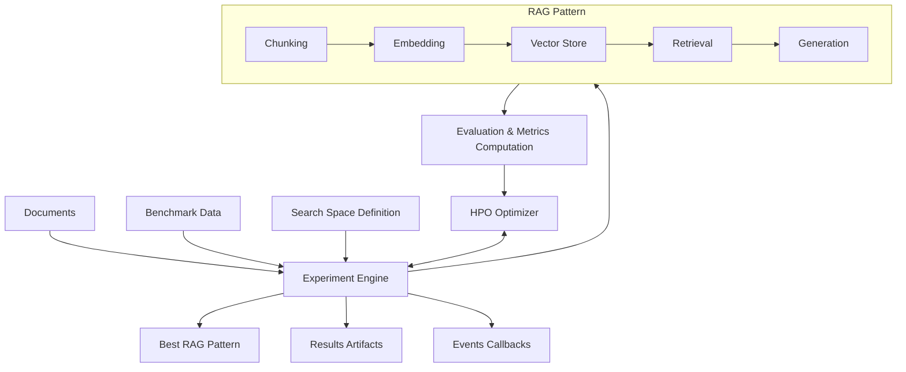

# Architecture Overview

ai4rag is designed as a modular RAG optimization engine with clear separation of concerns. This document provides a high-level overview of the system architecture.

---

## Design Principles

### Provider Agnostic

ai4rag is **LLM and Vector Database provider agnostic**. It integrates with various backends through:

- **Llama Stack**: Primary integration for models and vector stores
- **Pluggable Components**: Foundation models, embeddings, and vector stores are abstracted

### Template-Based Approach

The core concept is **RAG Templates** vs **RAG Patterns**:

- **RAG Template**: A RAG implementation with uninitialized parameters
- **RAG Pattern**: A RAG implementation with optimal parameter values (output of optimization)

### Optimization-Driven

Hyperparameter optimization is the central workflow:

1. Define a search space of possible configurations
2. Use HPO algorithms to explore configurations
3. Evaluate each configuration using metrics
4. Return the best-performing configuration

---

## High-Level Architecture



---

## Component Layers

### 1. Core Layer

**Experiment Engine** (`ai4rag/core/experiment/`)

- Orchestrates the entire optimization workflow
- Manages experiment lifecycle (setup, execution, teardown)
- Coordinates between HPO, RAG components, and evaluation
- Produces results and artifacts

**HPO Optimizers** (`ai4rag/core/hpo/`)

- Implements optimization algorithms
- Explores search space intelligently
- Suggests next configurations to evaluate
- Tracks optimization progress

### 2. Search Space Layer

**Search Space** (`ai4rag/search_space/`)

- Defines parameter ranges and types
- Validates configurations against rules
- Provides parameter sampling
- Enforces constraints (e.g., `chunk_size > chunk_overlap`)

### 3. RAG Components Layer

**Chunking** (`ai4rag/rag/chunking/`)

- Splits documents into chunks
- Configurable chunk size and overlap
- Uses LangChain text splitters

**Embedding** (`ai4rag/rag/embedding/`)

- Generates text embeddings
- Integrates with Llama Stack embedding models
- Handles batching and error recovery

**Vector Stores** (`ai4rag/rag/vector_store/`)

- Stores and retrieves document embeddings
- Supports Milvus (via Llama Stack) and ChromaDB
- Provides similarity search capabilities

**Retrieval** (`ai4rag/rag/retrieval/`)

- Retrieves relevant chunks for queries
- Supports simple and window-based retrieval
- Configurable top-k parameter

**Foundation Models** (`ai4rag/rag/foundation_models/`)

- Generates answers using LLMs
- Integrates with Llama Stack models
- Formats prompts with retrieved context

**Templates** (`ai4rag/rag/template/`)

- Complete RAG implementations
- Combines all RAG components
- Provides end-to-end RAG pipeline

### 4. Evaluation Layer

**Evaluator** (`ai4rag/evaluator/`)

- Wraps `unitxt` evaluation library
- Computes metrics: `faithfulness`, `answer_correctness` and `context_correctness`
- Compares generated answers to ground truth
- Returns scores for optimization

### 5. Utilities Layer

**Event Handlers** (`ai4rag/utils/event_handler/`)

- Provides hooks for experiment events
- Allows custom tracking and monitoring
- Useful for production integrations

**Validators** (`ai4rag/utils/`)

- Validates input data formats
- Checks configuration consistency
- Provides error messages

---

## Data Flow

### Indexing Phase

```
Documents
    ↓
Chunking (chunk_size, chunk_overlap)
    ↓
Embedding Model (embedding_model)
    ↓
Vector Store (ls_milvus or chroma)
```

### Query Phase (Per Configuration)

```
Question (from benchmark)
    ↓
Embedding Model
    ↓
Vector Store Search (number_of_chunks, retrieval_method, window_size)
    ↓
Retrieved Chunks
    ↓
Foundation Model (with context + question)
    ↓
Generated Answer
```

### Evaluation Phase

```
Generated Answer
Ground Truth Answer
Retrieved Documents
Ground Truth Documents
    ↓
Unitxt Evaluator
    ↓
Metrics (faithfulness, answer_correctness, context_correctness)
    ↓
Aggregated Score
    ↓
HPO Optimizer (feedback for next configuration)
```

---


## Extension Points

ai4rag is designed for extensibility:

1. **Custom Foundation Models**: Implement `BaseFoundationModel`
2. **Custom Embedding Models**: Implement `BaseEmbeddingModel`
3. **Custom Vector Stores**: Implement `BaseVectorStore`
4. **Custom HPO Algorithms**: Extend base optimizer classes
5. **Custom Event Handlers**: Implement `BaseEventHandler`
6. **Custom Metrics**: Integrate additional evaluators

---

## Technology Stack

- **Python**: 3.12 & 3.13
- **Llama Stack**: Model and vector store integration
- **LangChain**: Document chunking and processing
- **Unitxt**: Evaluation metrics
- **Pandas**: Results management
- **Pydantic**: Data validation

---

## Next Steps

- [Core Components](core-components.md) - Detailed component documentation
- [RAG Components](rag-components.md) - RAG pipeline details
- [Data Flow](data-flow.md) - In-depth workflow analysis
