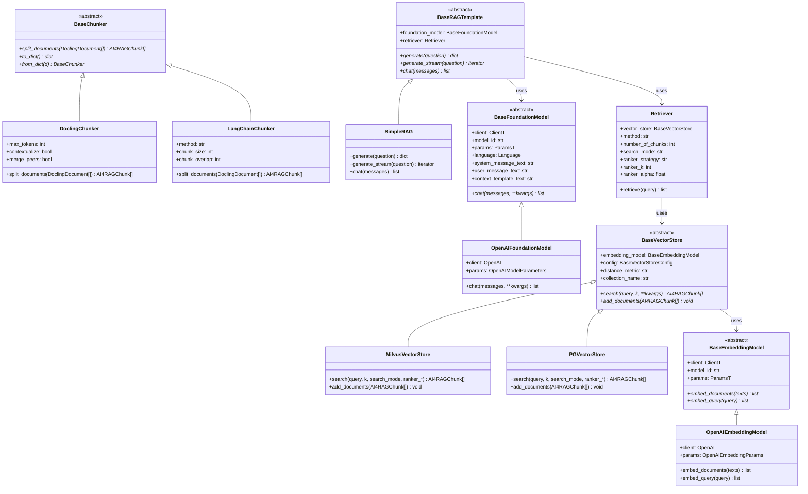

# RAG Components

This page provides detailed architecture documentation for the RAG pipeline components that ai4rag optimizes.

---

## Component Hierarchy



---

## Foundation Models

Foundation models generate text responses given prompts and retrieved context.

### BaseFoundationModel

Abstract base class defining the foundation model interface:

```python
class BaseFoundationModel(Generic[ClientT, ParamsT], ABC):
    def __init__(
        self,
        client: ClientT,
        model_id: str,
        params: ParamsT,
        system_message_text: str | None = None,
        user_message_text: str | None = None,
        context_template_text: str | None = None,
        language: Language | None = None,
    ):
```

**Language-Aware Prompt Generation:**

The optional `language` parameter accepts a `Language` dataclass (with `code` and `name` fields) and controls language-aware prompt template generation. When set, `user_message_text` is regenerated to include language-specific instructions. Defaults to `Language(code="", name="auto")`.

**Configurable Prompt Templates:**

Foundation models support three customizable prompt templates:

**1. system_message_text**

The system prompt that defines the model's behavior:

```python
# Default:
"You are a helpful, respectful and honest assistant. "
"Always answer as helpfully as possible, while being safe."
```

**2. user_message_text**

Template for formatting the user's question with retrieved context:

```python
# Default:
"{reference_documents}\n\nQuestion: {question}\nAnswer:"
```

Placeholders:
- `{reference_documents}`: Formatted context from retrieval
- `{question}`: The user's question

**3. context_template_text**

Template for formatting each retrieved document:

```python
# Default:
"According to the document: {document}\n"
```

Placeholder:
- `{document}`: Individual chunk's text content

**Customization Example:**

```python
foundation_model = OpenAIFoundationModel(
    model_id="ollama/llama3.2:3b",
    client=client,
    system_message_text="You are a technical documentation assistant specialized in software APIs.",
    user_message_text="Context:\n{reference_documents}\n\nUser Question: {question}\n\nDetailed Answer:",
    context_template_text="[Document {document_id}] {document}\n\n"
)
```

**Prompt Template Validation:**

The `user_message_text` and `context_template_text` attributes are validated properties that check for required placeholders (`{question}`, `{reference_documents}` in user message; `{document}` in context template) on assignment. Invalid templates raise a `ValueError`.

**Interface Method:**

```python
@abstractmethod
def chat(self, messages: list[MessageTyped], **kwargs) -> list[MessageTyped]:
    """Chat with the model based on the client capabilities."""
```

**MessageTyped Format:**

```python
class MessageTyped(TypedDict):
    role: str      # "system", "user", or "assistant"
    content: str   # Message text
```

### OpenAIFoundationModel

OpenShift MaaS (and any OpenAI-compatible API) integration for foundation models:

```python
class OpenAIFoundationModel(BaseFoundationModel[OpenAI, OpenAIModelParameters]):
    def __init__(
        self,
        client: OpenAI,
        model_id: str,
        params: dict | OpenAIModelParameters | None = None,
        system_message_text: str | None = None,
        user_message_text: str | None = None,
        context_template_text: str | None = None,
        language: Language | None = None,
    ):
```

**Parameters:**

```python
@dataclass
class OpenAIModelParameters:
    max_completion_tokens: int = 1024  # Max tokens in response
    temperature: float = 0.1            # Sampling temperature (0.0-1.0)
```

**Chat Implementation:**

```python
def chat(self, messages: list[MessageTyped], **kwargs) -> list[MessageTyped]:
    response = self.client.chat.completions.create(
        model=self.model_id,
        messages=messages,
        max_completion_tokens=self.params.max_completion_tokens,
        temperature=self.params.temperature,
    )
    return response.choices  # List of response choices
```

**Usage:**

```python
foundation_model = OpenAIFoundationModel(
    model_id="ollama/llama3.2:3b",
    client=maas_client,
    params={"max_completion_tokens": 512, "temperature": 0.0}
)

messages = [
    {"role": "system", "content": "You are a helpful assistant."},
    {"role": "user", "content": "What is 2+2?"}
]

response = foundation_model.chat(messages)
answer = response[0].message.content
```

---

## Embedding Models

Embedding models convert text into dense vector representations for semantic search.

### BaseEmbeddingModel

Abstract base class for embedding models:

```python
class BaseEmbeddingModel(ABC, Generic[ClientT, ParamsT]):
    def __init__(
        self,
        client: ClientT,
        model_id: str,
        params: ParamsT | None = None
    ):
```

**Interface Methods:**

```python
@abstractmethod
def embed_documents(self, texts: list[str]) -> list[list[float]]:
    """Embed multiple documents (used during indexing)."""

@abstractmethod
def embed_query(self, query: str) -> list[float]:
    """Embed a single query (used during retrieval)."""
```

### OpenAIEmbeddingModel

OpenShift MaaS (and any OpenAI-compatible API) integration with auto-detection of model capabilities:

```python
class OpenAIEmbeddingModel(BaseEmbeddingModel[OpenAI, OpenAIEmbeddingParams]):
    def __init__(
        self,
        client: OpenAI,
        model_id: str,
        params: dict | OpenAIEmbeddingParams | None = None
    ):
```

**Parameters:**

```python
@dataclass
class OpenAIEmbeddingParams:
    embedding_dimension: int | None = None    # Auto-detected if None
    context_length: int | None = None         # Auto-detected if None
```

**Auto-Detection:**

When `embedding_dimension` or `context_length` not provided, the model auto-detects them on first use:

**Chunk Truncation:**

When a chunk exceeds the embedding model's context length, `OpenAIEmbeddingModel` automatically truncates it using a progressive margin strategy (5%, then 10%) before retrying. This prevents embedding failures for oversized chunks while preserving as much content as possible.

**Embedding Dimension Detection:**

```python
def _detect_embedding_dimension(self) -> int:
    """Embed a test string and count dimensions."""
    test_embedding = self._embed_text("test")[0]
    return len(test_embedding)  # e.g., 768 for nomic-embed-text
```

**Context Length Detection:**

```python
def _detect_context_length(self) -> int:
    """Binary search to find max context length."""
    lo, hi, best = 64, 8192, None

    while hi - lo >= 64:
        mid = (lo + hi) // 2
        probe_text = "word " * mid  # Approx. 1 word = 1 token
        try:
            self._embed_text(probe_text)
            best = mid
            lo = mid + 1
        except:
            hi = mid - 1

    return best
```

**Performance:** ~5 API calls for context length detection via binary search.

**Batch Processing:**

```python
def embed_documents(self, texts: list[str]) -> list[list[float]]:
    """Process in batches of 1024 to respect API limits."""
    embeddings = []
    for idx in range(0, len(texts), 1024):
        batch = texts[idx : idx + 1024]
        batch_embeddings = self._embed_text(batch)
        embeddings.extend(batch_embeddings)
    return embeddings
```

**Usage:**

```python
# Auto-detect parameters
embedding_model = OpenAIEmbeddingModel(
    model_id="ollama/nomic-embed-text:latest",
    client=maas_client,
)
# First call triggers detection:
# - embedding_dimension = 768 (detected)
# - context_length = 8192 (detected)

# Or explicitly provide parameters
embedding_model = OpenAIEmbeddingModel(
    model_id="ollama/nomic-embed-text:latest",
    client=maas_client,
    params={"embedding_dimension": 768, "context_length": 8192}
)

# Embed documents
embeddings = embedding_model.embed_documents(["text 1", "text 2", ...])
# Returns: [[0.1, -0.2, ...], [0.3, 0.1, ...], ...]

# Embed query
query_embedding = embedding_model.embed_query("What is X?")
# Returns: [0.05, -0.12, ...]
```

---

## Vector Stores

Vector stores manage document storage, embedding indexing, and similarity search.

### BaseVectorStore

Abstract base class for vector stores:

```python
class BaseVectorStore(ABC):
    def __init__(
        self,
        embedding_model: BaseEmbeddingModel,
        config: BaseVectorStoreConfig,
        distance_metric: str,
        collection_name: str | None = None
    ):
```

**Configuration:**

Every concrete store is constructed from a typed, frozen `config` dataclass (`MilvusConfig`, `MilvusLiteConfig`, or `PGVectorConfig`) that carries the backend's connection parameters and a `provider` discriminator (`"milvus"`, `"milvus_lite"`, `"pgvector"`). `MilvusConfig` and `MilvusLiteConfig` are separate, validated classes rather than two modes of a single config: `MilvusConfig.uri` must be an `http(s)://` URL (remote server or Zilliz Cloud) and raises `ValueError` otherwise, while `MilvusLiteConfig.db_path` is a local file path and raises `ValueError` if given an `http(s)://` value. Both are served by the same `MilvusVectorStore` implementation. Each config class exposes a `from_env()` classmethod that reads its own `*_ENV` variables, so connection details never need to be hardcoded in application code or generated artifacts (e.g. pattern notebooks).

**Collection naming (shared across all backends):**

The base class resolves `collection_name` once, in one place, via
`ai4rag.rag.vector_store.utils.resolve_collection_name`, so every backend
behaves identically:

- **Auto-generation** — when `collection_name` is `None`, a unique name of the
  form `ai4rag_<UTC timestamp>_<8 random chars>` is generated.
- **Mandatory `ai4rag` prefix** — a caller-supplied name **must** start with
  `ai4rag`. This prefix is the cross-backend isolation guard: because every
  collection (and, for pgvector, the physical table it maps to one-to-one)
  starts with it, ai4rag never creates, reuses, or drops a table/collection it
  does not own. A non-compliant name raises `ValueError` rather than being
  silently coerced.
- **Identifier safety** — the name is sanitized into a valid identifier
  (non-alphanumeric characters become underscores) and bounded to 63 characters
  (PostgreSQL's identifier limit), so it is usable verbatim as a backend
  collection name *and* as a physical SQL table name.

**Interface Methods:**

```python
@abstractmethod
def search(self, query: str, k: int, **kwargs) -> list[AI4RAGChunk]:
    """Search for k most relevant chunks."""

@abstractmethod
def add_documents(self, documents: Sequence[AI4RAGChunk]) -> None:
    """Add chunks to the collection."""

@property
def collection_name(self) -> str:
    """The resolved collection name (reused or auto-generated).

    Concrete on the base class — guaranteed to start with ``ai4rag`` and to be a
    valid, length-bounded identifier usable as both a collection name and a SQL
    table name.
    """
```

### Choosing a Backend

`ai4rag.rag.vector_store.get_vector_store` is the recommended entry point for constructing a vector store: it inspects `config.provider` and instantiates the matching concrete class, so callers do not need to import or branch on individual store classes.

```python
from ai4rag.rag.vector_store import get_vector_store, MilvusConfig

vector_store = get_vector_store(
    embedding_model=embedding_model,
    config=MilvusConfig.from_env(),
    collection_name=None,  # omit to auto-generate; pass an existing name to reuse it
)
```

**Signature:**

```python
def get_vector_store(
    embedding_model: BaseEmbeddingModel,
    config: MilvusConfig | MilvusLiteConfig | PGVectorConfig,
    collection_name: str | None = None,
) -> BaseVectorStore:
    """Backend selected by ``config.provider``; raises TypeError on a
    config/provider mismatch, ValueError for an unsupported provider."""
```

**Available Configs:**

| Config | `provider` | Key Fields | Env Vars |
|--------|------------|------------|----------|
| `MilvusConfig` | `"milvus"` | `uri` (required, must be an `http(s)://` URL — a remote server or Zilliz Cloud; raises `ValueError` otherwise), `token`, `server_cert` | `MILVUS_URI` (required, must be `http(s)://`), `MILVUS_TOKEN`, `MILVUS_SERVER_CERT` |
| `MilvusLiteConfig` | `"milvus_lite"` | `db_path` (a local file path, default `"./ai4rag_milvus_lite.db"`; raises `ValueError` if given an `http(s)://` value) | `MILVUS_LITE_DB_PATH` (optional) |
| `PGVectorConfig` | `"pgvector"` | `host`, `port`, `dbname`, `user`, `password` | `PGVECTOR_HOST`, `PGVECTOR_PORT`, `PGVECTOR_DB`, `PGVECTOR_USER`, `PGVECTOR_PASSWORD` |

!!! note "Why `MilvusConfig` and `MilvusLiteConfig` are separate"
    Previously, a single `MilvusConfig` selected between a remote server and embedded Milvus Lite purely from
    the shape of `uri` (a server URL vs. a local file path). That meant a mistyped or unreachable `MILVUS_URI`
    could be silently reinterpreted as a local path, creating an unintended throwaway local database instead
    of failing — a real risk in production. `MilvusConfig` now validates `uri` and raises `ValueError` for
    anything that is not an `http(s)://` URL, so a bad `MILVUS_URI` fails loudly. `MilvusLiteConfig` is the
    explicit, separate opt-in for the embedded engine.

`get_vector_store_config(provider)` and `get_vector_store_env_vars(provider)` complement `get_vector_store` when only a provider string is available (e.g. when building a config from the `vector_store_type` selected on the search space):

```python
from ai4rag.rag.vector_store import get_vector_store_config, get_vector_store_env_vars

config = get_vector_store_config("milvus")            # MilvusConfig.from_env()
config = get_vector_store_config("milvus_lite")        # MilvusLiteConfig.from_env()
env_vars = get_vector_store_env_vars("milvus")        # (("MILVUS_URI", "..."), ...)
```

### MilvusVectorStore

Vector store backed by `pymilvus`, supporting both pure dense vector search and hybrid search (dense + BM25 sparse) with **server-side** fusion. The same class serves two deployment modes, each configured through its own dedicated config class:

- **Remote Milvus server** (or Zilliz Cloud) — configured via `MilvusConfig`, whose `uri` must be a `http(s)://host:port` URL.
- **Milvus Lite** — configured via `MilvusLiteConfig`, whose `db_path` (e.g. `"./ai4rag.db"`) starts the embedded, zero-server Milvus Lite engine backed by that local file. This is the local, zero-setup replacement for the previously used in-memory Chroma store: recommended for local development, tests, and small-scale workloads (prototyping, up to roughly 1M vectors), not production. Milvus Lite computes BM25 IDF statistics segment-locally rather than corpus-wide, so hybrid-search ranking fidelity — and any benchmark/HPO scores measured against it — may not transfer exactly to a production server; it also serializes writes, so only one process should open a given `.db` file at a time.

```python
class MilvusVectorStore(BaseVectorStore):
    def __init__(
        self,
        embedding_model: BaseEmbeddingModel,
        config: MilvusConfig | MilvusLiteConfig,
        distance_metric: str = "cosine",
        collection_name: str | None = None,
    ):
```

**Connection Configuration:**

For `MilvusConfig`, TLS is driven entirely by the `uri` scheme: `https://` opens a secure channel, `http://` stays plaintext. For endpoints with a self-signed or private-CA certificate, pass the PEM text via `server_cert`. `MilvusLiteConfig` has no network/TLS concerns — it only takes a local `db_path`.

```python
from ai4rag.rag.vector_store import MilvusConfig, MilvusLiteConfig

# Remote server, from environment: MILVUS_URI (required, http(s)://), MILVUS_TOKEN, MILVUS_SERVER_CERT
config = MilvusConfig.from_env()

# Remote server, explicit
config = MilvusConfig(uri="https://localhost:19530", token="user:pass")

# Embedded Milvus Lite, explicit local file (or MilvusLiteConfig() for the default path)
config = MilvusLiteConfig(db_path="./ai4rag.db")
```

**Collection Schema:**

For a new collection, `MilvusVectorStore` creates a schema with a primary `chunk_id`, an analyzed `content` field, a dense `vector` field sized to the embedding model's dimension, a `chunk_content` JSON payload, and a `sparse` BM25 vector — with a FLAT/COSINE index on `vector`, a sparse inverted BM25 index on `sparse`, and a BM25 function deriving `sparse` from `content`. When `collection_name` names an existing collection, it is reused unchanged.

**Hybrid Search Support:**

```python
def search(
    self,
    query: str,
    k: int = 5,
    include_scores: bool = False,
    search_mode: str = "vector",
    ranker_strategy: str | None = None,
    ranker_k: int | None = None,
    ranker_alpha: float | None = None,
    **kwargs,
) -> list[AI4RAGChunk] | list[tuple[AI4RAGChunk, float]]:
```

**Search Modes:**

**1. Vector Mode (default):**

```python
results = vector_store.search(
    query="What is X?",
    k=5,
    search_mode="vector"
)
```

Pure semantic search using dense embeddings.

**2. Hybrid Mode:**

```python
results = vector_store.search(
    query="What is X?",
    k=5,
    search_mode="hybrid",
    ranker_strategy="rrf",
    ranker_k=60
)
```

Issues a dense `AnnSearchRequest` on `vector` and a sparse `AnnSearchRequest` on `sparse`, fused **on the Milvus server** with a native `RRFRanker` or `WeightedRanker`.

**Ranker Strategies:**

| Strategy | Description | Parameters |
|----------|-------------|------------|
| `"rrf"` | Reciprocal Rank Fusion (default fallback) | `ranker_k`: smoothing constant (30-100), default 60 |
| `"weighted"` | Weighted combination | `ranker_alpha`: dense weight (0.0-1.0), default 0.5; sparse weight is `1 - ranker_alpha` |
| `"normalized"` | Falls through to RRF fusion | Strategy-specific |

**RRF Example:**

```python
results = vector_store.search(
    query="What is X?",
    k=5,
    search_mode="hybrid",
    ranker_strategy="rrf",
    ranker_k=60,
)
```

**Weighted Example:**

```python
# 70% dense (semantic), 30% sparse (keyword)
results = vector_store.search(
    query="What is X?",
    k=5,
    search_mode="hybrid",
    ranker_strategy="weighted",
    ranker_alpha=0.7,
)
```

**Validation:**

`MilvusVectorStore` and `PGVectorStore` both validate their hybrid search parameters through the shared `ai4rag.rag.vector_store.utils.validate_search_params`:

```python
def validate_search_params(search_mode, ranker_strategy, ranker_k, ranker_alpha):
    # When search_mode != "hybrid":
    #   - ranker_strategy must be None or ""
    #   - ranker_k must be None or 0
    #   - ranker_alpha must be None or 1

    # When search_mode == "hybrid":
    #   - ranker_strategy must be non-empty ("rrf", "weighted", "normalized")
    #   - ranker_k > 0 only for "rrf"
    #   - ranker_alpha != 1 only for "weighted"
```

**Document Addition:**

```python
def add_documents(self, documents: list[AI4RAGChunk], **kwargs) -> None:
    """Embed, deduplicate by chunk_id, and upsert chunks into Milvus."""
    embeddings = self.embedding_model.embed_documents([doc.text for doc in documents])

    data = [
        {
            "chunk_id": doc.chunk_id,
            "content": doc.text,
            "vector": embedding,
            "chunk_content": {"content": doc.text, "metadata": doc.metadata, "chunk_id": doc.chunk_id},
        }
        for doc, embedding in iter_unique_chunks(documents, embeddings)
    ]

    batch_size = kwargs.get("batch_size", self._BATCH_SIZE)  # default 2048
    for idx in range(0, len(data), batch_size):
        self._client.upsert(self._collection_name, data=data[idx : idx + batch_size])
```

**Usage:**

```python
from ai4rag.rag.vector_store import MilvusConfig
from ai4rag.rag.vector_store.milvus import MilvusVectorStore

# Create vector store (omit collection_name to auto-generate a new collection)
vector_store = MilvusVectorStore(
    embedding_model=embedding_model,
    config=MilvusConfig.from_env(),
)

# Index documents
vector_store.add_documents(chunked_documents)

# Vector search
results = vector_store.search(query="What is X?", k=5)

# Hybrid search with RRF
results = vector_store.search(
    query="What is X?",
    k=5,
    search_mode="hybrid",
    ranker_strategy="rrf",
    ranker_k=60
)

# Hybrid search with weighted ranker
results = vector_store.search(
    query="What is X?",
    k=5,
    search_mode="hybrid",
    ranker_strategy="weighted",
    ranker_alpha=0.7
)

# Reuse an existing collection instead of creating a new one
vector_store = MilvusVectorStore(
    embedding_model=embedding_model,
    config=MilvusConfig.from_env(),
    collection_name="ai4rag_20260701120000_ab12cd34",
)
```

### PGVectorStore

Vector store backed by PostgreSQL with the `pgvector` extension, supporting pure dense vector search and hybrid search (dense vector + `tsvector` full-text) with **in-memory** fusion:

```python
class PGVectorStore(BaseVectorStore):
    def __init__(
        self,
        embedding_model: BaseEmbeddingModel,
        config: PGVectorConfig,
        distance_metric: str = "cosine",
        collection_name: str | None = None,
    ):
```

**Connection Configuration:**

```python
from ai4rag.rag.vector_store import PGVectorConfig

# From environment: PGVECTOR_HOST, PGVECTOR_PORT, PGVECTOR_DB, PGVECTOR_USER, PGVECTOR_PASSWORD
config = PGVectorConfig.from_env()

# Or explicit
config = PGVectorConfig(host="localhost", port=5432, dbname="ai4rag", user="ai4rag", password="secret")
```

**Table Mapping:**

The resolved `collection_name` is used verbatim as the physical PostgreSQL table name — created with an `id` primary key, a `document` JSONB payload, an `embedding` vector column, `content_text`, and a `tokenized_content` `tsvector` column feeding full-text search. Supported `distance_metric` values are `"cosine"`, `"l2"`, `"l1"`, and `"inner_product"`.

!!! note "Embedding dimensions above 2000"
    pgvector caps HNSW/IVFFlat indexes on the `vector` type at 2000 dimensions. `PGVectorStore` still creates the table and stores/queries vectors of any dimension pgvector supports (up to 16,000) — above 2000, it simply skips building the HNSW index and logs a warning, so searches fall back to an exact sequential scan instead of an approximate one. Results remain correct; only per-query latency scales with collection size. For very large, high-dimension collections where scan latency matters, `MilvusVectorStore` remains available.

**Hybrid Search:**

`PGVectorStore.search` accepts the same `search_mode`, `ranker_strategy`, `ranker_k`, and `ranker_alpha` parameters as `MilvusVectorStore` (see the **Ranker Strategies** table under [MilvusVectorStore](#milvusvectorstore) above). The fusion mechanics differ, however: the dense search orders rows by the configured pgvector distance operator, the keyword search ranks rows by `ts_rank` against a `plainto_tsquery`, and the two independent score maps are combined **in Python** via `WeightedInMemoryAggregator` (see [Reranker](#reranker) below) before the top `k` results are returned.

**Usage:**

```python
from ai4rag.rag.vector_store import PGVectorConfig
from ai4rag.rag.vector_store.pgvector import PGVectorStore

vector_store = PGVectorStore(
    embedding_model=embedding_model,
    config=PGVectorConfig.from_env(),
)

vector_store.add_documents(chunked_documents)

# Hybrid search with RRF
results = vector_store.search(
    query="What is X?",
    k=5,
    search_mode="hybrid",
    ranker_strategy="rrf",
    ranker_k=60,
)
```

### Reranker

`ai4rag.rag.vector_store.reranker.WeightedInMemoryAggregator` implements the in-memory score fusion used by `PGVectorStore`'s hybrid search (Milvus fuses server-side instead, via its native rankers). It exposes three static methods:

```python
class WeightedInMemoryAggregator:
    @staticmethod
    def weighted_rerank(
        vector_scores: dict[str, float],
        keyword_scores: dict[str, float],
        alpha: float = 0.5,
    ) -> dict[str, float]:
        """Weighted average of min-max normalized vector and keyword scores."""

    @staticmethod
    def rrf_rerank(
        vector_scores: dict[str, float],
        keyword_scores: dict[str, float],
        k: float = 60.0,
    ) -> dict[str, float]:
        """Reciprocal Rank Fusion of vector and keyword result rankings."""

    @staticmethod
    def combine_search_results(
        vector_scores: dict[str, float],
        keyword_scores: dict[str, float],
        reranker_type: str = "rrf",
        reranker_params: dict[str, Any] | None = None,
    ) -> dict[str, float]:
        """Dispatch to weighted_rerank or rrf_rerank based on reranker_type."""
```

`combine_search_results` is the single entry point: it dispatches to `weighted_rerank` (reading `reranker_params["alpha"]`) when `reranker_type == "weighted"`, and to `rrf_rerank` (reading `reranker_params["k"]`) otherwise — including for `"normalized"`, which currently falls through to RRF.

---

## Chunking

Chunkers split `DoclingDocument` objects into `AI4RAGChunk` instances for embedding and retrieval.

### AI4RAGChunk

Framework-agnostic chunk representation used across the pipeline:

```python
@dataclass
class AI4RAGChunk:
    text: str                                  # Chunk content
    metadata: dict[str, Any] = field(default_factory=dict)  # document_id, sequence_number, etc.
    chunk_id: str = field(init=False, repr=False)  # Deterministic SHA-256 (auto-computed)
```

### BaseChunker

Abstract base class for chunkers:

```python
class BaseChunker(ABC):
    @abstractmethod
    def split_documents(self, documents: Sequence[DoclingDocument]) -> list[AI4RAGChunk]:
        """Split documents into smaller chunks."""

    @abstractmethod
    def to_dict(self) -> dict[str, Any]:
        """Serialize chunker configuration."""

    @classmethod
    @abstractmethod
    def from_dict(cls, d: dict[str, Any]) -> "BaseChunker":
        """Deserialize chunker configuration."""
```

### DoclingChunker

Structure-aware, token-aware chunker wrapping docling's `HybridChunker`. Preserves document hierarchy (headings, tables, figures) during chunking:

```python
class DoclingChunker(BaseChunker):
    def __init__(
        self,
        max_tokens: int = 8192,
        contextualize: bool = True,
        tokenizer: BaseTokenizer | None = None,
        merge_peers: bool = True,
    ):
```

**Key Features:**

- Operates directly on `DoclingDocument` objects
- Token-bounded chunks aligned to the embedding model
- When `contextualize=True`, enriches each chunk with its heading hierarchy
- Merges adjacent undersized chunks that share the same heading context
- Does **not** support chunk overlap (overlap must be `0`)

**Usage:**

```python
chunker = DoclingChunker(max_tokens=1024, contextualize=True)

chunks = chunker.split_documents(docling_documents)
# Returns: list[AI4RAGChunk] with document_id, sequence_number, and headings metadata
```

### LangChainChunker

Token-based chunking via LangChain's `RecursiveCharacterTextSplitter`, adapted for `DoclingDocument` input:

```python
class LangChainChunker(BaseChunker):
    def __init__(
        self,
        method: Literal["recursive"] = "recursive",
        chunk_size: int = 2048,
        chunk_overlap: int = 256,
        **kwargs
    ):
```

**Chunking Method:**

Currently supports `"recursive"`. Converts each `DoclingDocument` to markdown internally, then applies token-based splitting using a character approximation (4 chars = 1 token):

```python
text_splitter = RecursiveCharacterTextSplitter(
    chunk_size=chunk_size,
    chunk_overlap=chunk_overlap,
    separators=["\n\n", r"(?<=\. )", "\n", " ", ""],
    length_function=lambda text: math.ceil(len(text) / 4),  # char-based approximation
    add_start_index=True,
)
```

**Splitting Hierarchy:**

1. **Double newlines** (`\n\n`): Paragraph boundaries
2. **Sentence boundaries** (`(?<=\. )`): After periods
3. **Single newlines** (`\n`): Line breaks
4. **Spaces** (` `): Word boundaries
5. **Characters** (`""`): Character-level splitting (last resort)

**Metadata Management:**

**1. Document ID Assignment:**

```python
def _set_document_id_in_metadata_if_missing(documents):
    for doc in documents:
        if "document_id" not in doc.metadata:
            doc.metadata["document_id"] = str(hash(doc.page_content))
```

**2. Sequence Number Assignment:**

```python
def _set_sequence_number_in_metadata(chunks):
    # Sort by (document_id, start_index)
    sorted_chunks = sorted(chunks, key=lambda x: (
        x.metadata["document_id"],
        x.metadata["start_index"]
    ))

    # Assign sequential numbers per document
    document_sequence = {}
    for chunk in sorted_chunks:
        doc_id = chunk.metadata["document_id"]
        seq_num = document_sequence.get(doc_id, 0) + 1
        document_sequence[doc_id] = seq_num
        chunk.metadata["sequence_number"] = seq_num

    return sorted_chunks
```

**Output Chunk Structure:**

```python
AI4RAGChunk(
    text="Chunk text content...",
    metadata={
        "document_id": "doc1",
        "sequence_number": 3,
        "start_index": 1024,
    }
)
```

**Usage:**

```python
chunker = LangChainChunker(
    method="recursive",
    chunk_size=512,
    chunk_overlap=128
)

chunks = chunker.split_documents(docling_documents)
# Returns: list[AI4RAGChunk] with sequence_number and start_index metadata
```

---

## Retrieval

The Retriever class coordinates document retrieval from vector stores.

### Retriever

```python
class Retriever:
    def __init__(
        self,
        vector_store: BaseVectorStore,
        number_of_chunks: int,
        method: Literal["simple", "window"] = "simple",
        search_mode: Literal["vector", "hybrid"] = "vector",
        ranker_strategy: str | None = None,
        ranker_k: int | None = None,
        ranker_alpha: float | None = None,
    ):
```

**Parameters:**

- **vector_store**: Vector store instance to query
- **number_of_chunks**: Top-k parameter (how many chunks to retrieve)
- **method**: Retrieval method
  - `"simple"`: Return top-k chunks as-is
  - `"window"`: Reserved for expanding each chunk with adjacent chunks; not distinctly implemented by the current backends (see below)
- **search_mode**: Search type
  - `"vector"`: Dense semantic search only
  - `"hybrid"`: Dense + sparse (keyword) search
- **ranker_strategy**: Hybrid search ranker (`"rrf"`, `"weighted"`, `"normalized"`)
- **ranker_k**: RRF smoothing parameter
- **ranker_alpha**: Weighted ranker dense/sparse balance

**Retrieve Method:**

```python
def retrieve(self, query: str, **kwargs) -> list[AI4RAGChunk]:
    """Retrieve relevant documents from vector store."""
    _number_of_chunks = kwargs.get("number_of_chunks", self.number_of_chunks)

    return self.vector_store.search(
        query,
        k=_number_of_chunks,
        search_mode=self.search_mode,
        ranker_strategy=self.ranker_strategy,
        ranker_k=self.ranker_k,
        ranker_alpha=self.ranker_alpha,
    )
```

**Simple vs Window Retrieval:**

Both current backends — **MilvusVectorStore** and **PGVectorStore** — always return simple top-k chunks; neither expands a retrieved chunk with its adjacent chunks, so `method="window"` currently behaves the same as `method="simple"`.

**Usage:**

```python
# Simple vector retrieval
retriever = Retriever(
    vector_store=vector_store,
    number_of_chunks=5,
    method="simple",
    search_mode="vector"
)

docs = retriever.retrieve("What is X?")
# Returns: [AI4RAGChunk(...), AI4RAGChunk(...), ...]  (5 chunks)

# Hybrid retrieval with RRF (Milvus, incl. Milvus Lite, or PGVector)
retriever = Retriever(
    vector_store=milvus_vector_store,
    number_of_chunks=5,
    method="simple",
    search_mode="hybrid",
    ranker_strategy="rrf",
    ranker_k=60
)

docs = retriever.retrieve("What is X?")
# Returns: 5 chunks re-ranked by RRF (dense + sparse)
```

---

## RAG Templates

RAG templates compose a retriever and a foundation model into end-to-end
retrieval-augmented generation. Index building is a separate, upstream concern
owned by `ai4rag.rag.vector_store` — build the index (chunk → embed → store)
before constructing a template.

### BaseRAGTemplate

Abstract interface for RAG templates:

```python
class BaseRAGTemplate(ABC):
    def __init__(
        self,
        foundation_model: BaseFoundationModel,
        retriever: Retriever,
    ):
```

**Interface Methods:**

```python
@abstractmethod
def generate(self, question: str, **kwargs) -> dict[str, Any]:
    """Generate answer for question using RAG pipeline."""

@abstractmethod
def generate_stream(self, question: str, **kwargs):
    """Generate streaming answer (for future streaming support)."""

@abstractmethod
def chat(self, messages: list[MessageTyped], **kwargs) -> list[Any]:
    """Run a RAG-enriched chat completion over a conversation history."""
```

### SimpleRAG

RAG implementation composing a retriever and a foundation model for retrieval
and generation:

```python
class SimpleRAG(BaseRAGTemplate):
    def __init__(
        self,
        foundation_model: BaseFoundationModel,
        retriever: Retriever,
    ):
```

**generate() Method:**

```python
def generate(self, question: str, **kwargs) -> dict[str, Any]:
    """Generate answer using RAG pipeline."""

    # 1. Retrieve relevant chunks and render the enriched user message
    reference_documents, user_message = self._build_enriched_user_message(question, **kwargs)

    # 2. Create messages
    messages = [
        {"role": "system", "content": self.foundation_model.system_message_text},
        {"role": "user", "content": user_message}
    ]

    # 3. Generate answer
    chat_response = self.foundation_model.chat(messages=messages)

    # 4. Return result
    return {
        "answer": chat_response[0].message.content,
        "reference_documents": reference_documents,
        "question": question
    }
```

`_build_enriched_user_message` (shared by `generate` and `chat`) retrieves
chunks via `self.retriever.retrieve(question, **kwargs)`, formats each with
`foundation_model.context_template_text`, and renders the final user message
with `foundation_model.user_message_text`.

**generate_stream() Method:**

```python
def generate_stream(self, question: str, **kwargs):
    """Placeholder for streaming (currently non-streaming)."""
    result = self.generate(question, **kwargs)
    yield result["answer"]
```

**chat() Method:**

Chat-completions-style entry point: forwards prior conversation history to the
foundation model unchanged, RAG-enriching only the last (current) user turn.
The template's own system message is always prepended, so `messages` should
not include one:

```python
def chat(self, messages: list[MessageTyped], **kwargs) -> list[Any]:
    if not messages:
        raise ValueError("`messages` must contain at least one message.")

    *history, last_message = messages
    _, enriched_content = self._build_enriched_user_message(last_message["content"], **kwargs)

    rag_messages = [
        {"role": "system", "content": self.foundation_model.system_message_text},
        *history,
        {**last_message, "content": enriched_content},
    ]

    return self.foundation_model.chat(messages=rag_messages, **kwargs)
```

**Usage:**

```python
# Build the index upstream, then construct the template
vector_store.add_documents(chunker.split_documents(documents))

rag = SimpleRAG(
    foundation_model=foundation_model,
    retriever=retriever,
)

# Generate answer
result = rag.generate("What is the capital of France?")
print(result["answer"])
# "Based on the provided documents, Paris is the capital of France."

print(result["reference_documents"])
# [AI4RAGChunk(...), AI4RAGChunk(...), ...]

# Or drive it as a chat completion over conversation history
response = rag.chat(messages=[
    {"role": "user", "content": "What is the capital of France?"},
])
```

**Within AI4RAGExperiment:**

The experiment creates SimpleRAG instances automatically during evaluation,
after indexing has already populated the vector store:

```python
rag_pattern = SimpleRAG(
    foundation_model=foundation_model,
    retriever=retriever
)
# Note: chunking, embedding, and vector store insertion happen separately,
#       upstream, during the experiment's indexing phase
```

---

## Component Integration Example

Full RAG pipeline with all components:

```python
import os
from ai4rag.utils.clients.maas_client import create_maas_client
from ai4rag.rag.foundation_models.openai_model import OpenAIFoundationModel
from ai4rag.rag.embedding.openai_model import OpenAIEmbeddingModel
from ai4rag.rag.vector_store import get_vector_store, MilvusConfig
from ai4rag.rag.chunking.langchain_chunker import LangChainChunker
from ai4rag.rag.retrieval.retriever import Retriever
from ai4rag.rag.template.simple_rag_template import SimpleRAG

# 1. A single client serves everything: it lists available models and serves
#    chat/completions and embeddings for all of them at the one MaaS endpoint.
maas_client = create_maas_client(
    base_url=os.getenv("MAAS_BASE_URL"),
    api_key=os.getenv("MAAS_API_KEY"),
)

# 2. Create foundation model — model ids are used verbatim, exactly as
#    models.list() reports them, on the shared client.
foundation_model = OpenAIFoundationModel(
    model_id="qwen3-8b-fp8-dynamic",
    client=maas_client,
    params={"max_completion_tokens": 512, "temperature": 0.1}
)

# 3. Create embedding model — same shared client
embedding_model = OpenAIEmbeddingModel(
    model_id="bge-m3",
    client=maas_client,
    params={"embedding_dimension": 1024, "context_length": 8192}
)

# 4. Create vector store — a direct-client store selected by config.provider
#    (swap MilvusConfig for MilvusLiteConfig(db_path=...) for embedded local
#    storage, or PGVectorConfig for PostgreSQL/pgvector)
vector_store = get_vector_store(
    embedding_model=embedding_model,
    config=MilvusConfig.from_env(),
)

# 5. Create chunker
chunker = LangChainChunker(
    method="recursive",
    chunk_size=512,
    chunk_overlap=128
)

# 6. Index documents: chunk -> embed -> store (upstream of the template)
vector_store.add_documents(chunker.split_documents(documents))

# 7. Create retriever
retriever = Retriever(
    vector_store=vector_store,
    number_of_chunks=5,
    method="simple",
    search_mode="hybrid",
    ranker_strategy="rrf",
    ranker_k=60
)

# 8. Create RAG template
rag = SimpleRAG(
    foundation_model=foundation_model,
    retriever=retriever,
)

# 9. Generate answer
result = rag.generate("What is X?")
print(result["answer"])
```

---

## Extension Points

All RAG components are designed for extensibility:

### Custom Foundation Model

```python
class CustomFoundationModel(BaseFoundationModel[MyClient, MyParams]):
    def chat(self, messages: list[MessageTyped], **kwargs) -> list[MessageTyped]:
        # Your implementation
        pass
```

### Custom Embedding Model

```python
class CustomEmbeddingModel(BaseEmbeddingModel[MyClient, MyParams]):
    def embed_documents(self, texts: list[str]) -> list[list[float]]:
        # Your implementation
        pass

    def embed_query(self, query: str) -> list[float]:
        # Your implementation
        pass
```

### Custom Vector Store

```python
class CustomVectorStore(BaseVectorStore):
    def search(self, query: str, k: int, **kwargs) -> list[AI4RAGChunk]:
        # Your implementation
        pass

    def add_documents(self, documents: Sequence[AI4RAGChunk]) -> None:
        # Your implementation
        pass

    @property
    def collection_name(self) -> str:
        return self._collection_name
```

### Custom RAG Template

```python
class CustomRAG(BaseRAGTemplate):
    def generate(self, question: str, **kwargs) -> dict[str, Any]:
        # Your generation logic
        pass

    def generate_stream(self, question: str, **kwargs):
        # Your streaming logic
        pass

    def chat(self, messages: list[MessageTyped], **kwargs) -> list[Any]:
        # Your chat-completion logic
        pass
```

---

## Best Practices

**Foundation Models:**

1. **Customize prompts** for your domain (system_message_text, user_message_text)
2. **Use low temperature** (0.0-0.2) for factual Q&A
3. **Adjust max_completion_tokens** based on expected answer length

**Embedding Models:**

1. **Provide embedding_dimension and context_length** explicitly to avoid auto-detection overhead
2. **Choose models matching your language** (multilingual vs English-only)
3. **Consider embedding dimension** (higher = more expressive but slower/larger)

**Vector Stores:**

1. **Use a remote Milvus server or PGVector for production** hybrid search (server-side fusion for Milvus, in-memory fusion for PGVector)
2. **Use Milvus Lite** (`MilvusLiteConfig` with a local `db_path`) for development/testing (embedded, zero-server, simpler setup)
3. **Enable hybrid search** for keyword-heavy domains (technical docs, legal, medical) — supported by both backends, including Milvus Lite
4. **Tune ranker parameters** (ranker_k, ranker_alpha) via optimization

**Chunking:**

1. **Smaller chunks** (256-512) for precise Q&A
2. **Larger chunks** (1024-2048) for broader context
3. **Adjust chunk_overlap** (25-50% of chunk_size) to maintain coherence
4. **Ensure chunk_size < embedding context_length**

**Retrieval:**

1. **Start with simple retrieval** before trying window-based
2. **Use hybrid search** when semantic search misses exact matches
3. **Tune number_of_chunks** (5-10 typical) via optimization
4. **Monitor retrieval quality** via context_correctness metric

---

## Next Steps

- [Core Components](core-components.md) - Experiment engine and HPO details
- [Data Flow](data-flow.md) - Detailed workflow analysis
- [Architecture Overview](overview.md) - High-level design
