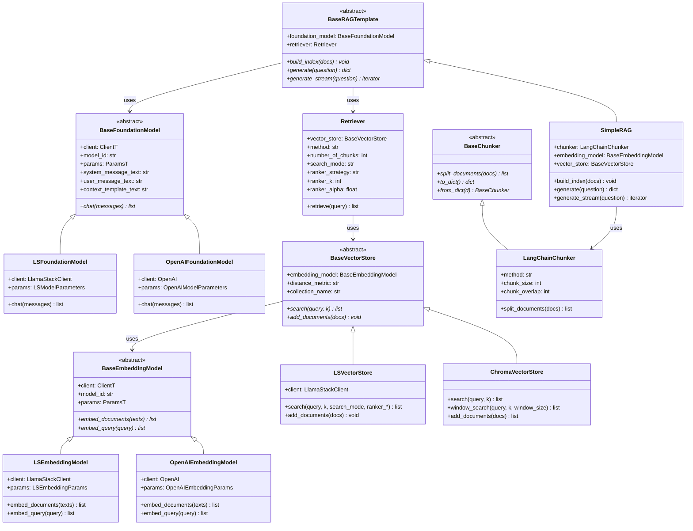

# RAG Components

This page provides detailed architecture documentation for the RAG pipeline components that ai4rag optimizes.

---

## Component Hierarchy



---

## Foundation Models

Foundation models generate text responses given prompts and retrieved context.

### BaseFoundationModel

Abstract base class defining the foundation model interface:

```python
class BaseFoundationModel(Generic[ClientT, ParamsT], ABC):
    def __init__(
        self,
        client: ClientT,
        model_id: str,
        params: ParamsT,
        system_message_text: str | None = None,
        user_message_text: str | None = None,
        context_template_text: str | None = None,
    ):
```

**Configurable Prompt Templates:**

Foundation models support three customizable prompt templates:

**1. system_message_text**

The system prompt that defines the model's behavior:

```python
# Default:
"You are a helpful, respectful and honest assistant. "
"Always answer as helpfully as possible, while being safe."
```

**2. user_message_text**

Template for formatting the user's question with retrieved context:

```python
# Default:
"{reference_documents}\n\nQuestion: {question}\nAnswer:"
```

Placeholders:
- `{reference_documents}`: Formatted context from retrieval
- `{question}`: The user's question

**3. context_template_text**

Template for formatting each retrieved document:

```python
# Default:
"According to the document: {document}\n"
```

Placeholder:
- `{document}`: Individual chunk's `page_content`

**Customization Example:**

```python
foundation_model = LSFoundationModel(
    model_id="ollama/llama3.2:3b",
    client=client,
    system_message_text="You are a technical documentation assistant specialized in software APIs.",
    user_message_text="Context:\n{reference_documents}\n\nUser Question: {question}\n\nDetailed Answer:",
    context_template_text="[Document {document_id}] {document}\n\n"
)
```

**Interface Method:**

```python
@abstractmethod
def chat(self, messages: list[MessageTyped]) -> list[MessageTyped]:
    """Chat with the model based on the client capabilities."""
```

**MessageTyped Format:**

```python
class MessageTyped(TypedDict):
    role: str      # "system", "user", or "assistant"
    content: str   # Message text
```

### LSFoundationModel

Llama Stack integration for foundation models:

```python
class LSFoundationModel(BaseFoundationModel[LlamaStackClient, LSModelParameters]):
    def __init__(
        self,
        client: LlamaStackClient,
        model_id: str,
        params: dict | LSModelParameters | None = None,
        system_message_text: str | None = None,
        user_message_text: str | None = None,
        context_template_text: str | None = None,
    ):
```

**Parameters:**

```python
@dataclass
class LSModelParameters:
    max_completion_tokens: int = 1024  # Max tokens in response
    temperature: float = 0.1            # Sampling temperature (0.0-1.0)
```

**Chat Implementation:**

```python
def chat(self, messages: list[MessageTyped]) -> list[MessageTyped]:
    response = self.client.chat.completions.create(
        model=self.model_id,
        messages=messages,
        max_completion_tokens=self.params.max_completion_tokens,
        temperature=self.params.temperature,
    )
    return response.choices  # List of response choices
```

**Usage:**

```python
foundation_model = LSFoundationModel(
    model_id="ollama/llama3.2:3b",
    client=llama_stack_client,
    params={"max_completion_tokens": 512, "temperature": 0.0}
)

messages = [
    {"role": "system", "content": "You are a helpful assistant."},
    {"role": "user", "content": "What is 2+2?"}
]

response = foundation_model.chat(messages)
answer = response[0].message.content
```

### OpenAIFoundationModel

OpenAI integration for foundation models:

```python
class OpenAIFoundationModel(BaseFoundationModel[OpenAI, OpenAIModelParameters]):
    # Similar interface to LSFoundationModel but uses OpenAI client
```

**Supported Models:**
- GPT-4, GPT-4 Turbo
- GPT-3.5 Turbo
- Any model accessible via OpenAI API

---

## Embedding Models

Embedding models convert text into dense vector representations for semantic search.

### BaseEmbeddingModel

Abstract base class for embedding models:

```python
class BaseEmbeddingModel(ABC, Generic[ClientT, ParamsT]):
    def __init__(
        self,
        client: ClientT,
        model_id: str,
        params: ParamsT | None = None
    ):
```

**Interface Methods:**

```python
@abstractmethod
def embed_documents(self, texts: list[str]) -> list[list[float]]:
    """Embed multiple documents (used during indexing)."""

@abstractmethod
def embed_query(self, query: str) -> list[float]:
    """Embed a single query (used during retrieval)."""
```

### LSEmbeddingModel

Llama Stack integration with auto-detection of model capabilities:

```python
class LSEmbeddingModel(BaseEmbeddingModel[LlamaStackClient, LSEmbeddingParams]):
    def __init__(
        self,
        client: LlamaStackClient,
        model_id: str,
        params: dict | LSEmbeddingParams | None = None
    ):
```

**Parameters:**

```python
@dataclass
class LSEmbeddingParams:
    embedding_dimension: int | None = None    # Auto-detected if None
    context_length: int | None = None         # Auto-detected if None
    timeout: float | Timeout | None = None
    model_type: str | None = None
    provider_id: str | None = None
    provider_resource_id: str | None = None
```

**Auto-Detection:**

When `embedding_dimension` or `context_length` not provided, the model auto-detects them on first use:

**Embedding Dimension Detection:**

```python
def _detect_embedding_dimension(self) -> int:
    """Embed a test string and count dimensions."""
    test_embedding = self._embed_text("test")[0]
    return len(test_embedding)  # e.g., 768 for nomic-embed-text
```

**Context Length Detection:**

```python
def _detect_context_length(self) -> int:
    """Binary search to find max context length."""
    lo, hi, best = 64, 8192, None

    while hi - lo >= 64:
        mid = (lo + hi) // 2
        probe_text = "word " * mid  # Approx. 1 word = 1 token
        try:
            self._embed_text(probe_text)
            best = mid
            lo = mid + 1
        except:
            hi = mid - 1

    return best
```

**Performance:** ~5 API calls for context length detection via binary search.

**Batch Processing:**

```python
def embed_documents(self, texts: list[str]) -> list[list[float]]:
    """Process in batches of 2048 to respect API limits."""
    embeddings = []
    for idx in range(0, len(texts), 2048):
        batch = texts[idx : idx + 2048]
        batch_embeddings = self._embed_text(batch)
        embeddings.extend(batch_embeddings)
    return embeddings
```

**Usage:**

```python
# Auto-detect parameters
embedding_model = LSEmbeddingModel(
    model_id="ollama/nomic-embed-text:latest",
    client=llama_stack_client,
)
# First call triggers detection:
# - embedding_dimension = 768 (detected)
# - context_length = 8192 (detected)

# Or explicitly provide parameters
embedding_model = LSEmbeddingModel(
    model_id="ollama/nomic-embed-text:latest",
    client=llama_stack_client,
    params={"embedding_dimension": 768, "context_length": 8192}
)

# Embed documents
embeddings = embedding_model.embed_documents(["text 1", "text 2", ...])
# Returns: [[0.1, -0.2, ...], [0.3, 0.1, ...], ...]

# Embed query
query_embedding = embedding_model.embed_query("What is X?")
# Returns: [0.05, -0.12, ...]
```

### OpenAIEmbeddingModel

OpenAI integration for embeddings:

```python
class OpenAIEmbeddingModel(BaseEmbeddingModel[OpenAI, OpenAIEmbeddingParams]):
    # Similar interface but uses OpenAI client
```

**Supported Models:**
- text-embedding-3-small
- text-embedding-3-large
- text-embedding-ada-002

---

## Vector Stores

Vector stores manage document storage, embedding indexing, and similarity search.

### BaseVectorStore

Abstract base class for vector stores:

```python
class BaseVectorStore(ABC):
    def __init__(
        self,
        embedding_model: BaseEmbeddingModel,
        distance_metric: str,
        reuse_collection_name: str | None = None
    ):
```

**Interface Methods:**

```python
@abstractmethod
def search(self, query: str, k: int, **kwargs) -> list[Document]:
    """Search for k most relevant chunks."""

@abstractmethod
def add_documents(self, documents: Sequence[Document]) -> None:
    """Add documents to the collection."""

@property
@abstractmethod
def collection_name(self) -> str:
    """Returns collection name (reused or newly created)."""
```

### ChromaVectorStore

In-memory ChromaDB implementation for development and testing:

```python
class ChromaVectorStore(BaseVectorStore):
    def __init__(
        self,
        embedding_model: BaseEmbeddingModel,
        reuse_collection_name: str | None = None,
        distance_metric: str = "cosine",
        **kwargs
    ):
```

**Supported Distance Metrics:**

- `"cosine"`: Cosine similarity (default)
- `"l2"`: Euclidean distance

**Search Methods:**

**1. Standard Search:**

```python
def search(
    self,
    query: str,
    k: int = 5,
    include_scores: bool = False,
    **kwargs
) -> list[Document] | list[tuple[Document, float]]:
    """Vector similarity search."""
```

**2. Window Search:**

```python
def window_search(
    self,
    query: str,
    k: int = 5,
    window_size: int = 2,
    include_scores: bool = False,
    **kwargs
) -> list[Document]:
    """Retrieve chunks + adjacent chunks (window) from same document."""
```

**Window Search Details:**

For each retrieved chunk:
1. Extract `document_id` and `sequence_number` from metadata
2. Query vector store for chunks with:
   - Same `document_id`
   - `sequence_number` in `[seq - window_size, seq + window_size]`
3. Sort by `sequence_number`
4. Merge into single document (concatenate `page_content`)

**Example:**

```python
# Retrieved chunk: document_id="doc1", sequence_number=5
# window_size=2
# Fetches chunks with sequence_number in [3, 4, 5, 6, 7]
# Returns merged document with all 5 chunks concatenated
```

**Batch Document Addition:**

```python
def add_documents(self, documents: list, max_batch_size: int = 2048) -> list[str]:
    """Add documents in batches of max_batch_size."""
    for batch_start in range(0, len(docs), max_batch_size):
        batch = docs[batch_start : batch_start + max_batch_size]
        self._vector_store.add_documents(batch, ids=ids)
```

**Usage:**

```python
vector_store = ChromaVectorStore(
    embedding_model=embedding_model,
    distance_metric="cosine"
)

# Index documents
vector_store.add_documents(chunked_documents)

# Search
results = vector_store.search(query="What is X?", k=5)
# Returns: [Document(...), Document(...), ...]

# Window search
results = vector_store.window_search(query="What is X?", k=5, window_size=2)
# Returns: [merged_doc_1, merged_doc_2, ...]
```

### LSVectorStore

Llama Stack integration supporting any vector store provider and hybrid search:

```python
class LSVectorStore(BaseVectorStore):
    def __init__(
        self,
        embedding_model: LSEmbeddingModel,
        client: LlamaStackClient,
        provider_id: str,
        reuse_collection_name: str | None = None,
        distance_metric: str | None = None,
    ):
```

**Provider-Agnostic Design:**

The `provider_id` parameter determines the backend vector store:

```python
# Milvus
vector_store = LSVectorStore(
    embedding_model=embedding_model,
    client=client,
    provider_id="milvus"
)

# Qdrant
vector_store = LSVectorStore(
    embedding_model=embedding_model,
    client=client,
    provider_id="qdrant"
)

# Any provider supported by Llama Stack server
```

**Collection Creation:**

```python
vs = client.vector_stores.create(
    extra_body={
        "provider_id": provider_id,
        "embedding_model": embedding_model.model_id,
        "embedding_dimension": embedding_model.params.embedding_dimension,
    }
)
collection_name = vs.id  # Unique collection identifier
```

**Hybrid Search Support:**

```python
def search(
    self,
    query: str,
    k: int,
    search_mode: str = "vector",
    ranker_strategy: str | None = None,
    ranker_k: int | None = None,
    ranker_alpha: float | None = None,
    **kwargs
) -> list[Document]:
```

**Search Modes:**

**1. Vector Mode (default):**

```python
results = vector_store.search(
    query="What is X?",
    k=5,
    search_mode="vector"
)
```

Pure semantic search using dense embeddings.

**2. Hybrid Mode:**

```python
results = vector_store.search(
    query="What is X?",
    k=5,
    search_mode="hybrid",
    ranker_strategy="rrf",
    ranker_k=60
)
```

Combines dense vector search with sparse keyword search (e.g., BM25).

**Ranker Strategies:**

| Strategy | Description | Parameters |
|----------|-------------|------------|
| `"rrf"` | Reciprocal Rank Fusion | `ranker_k`: smoothing constant (30-100) |
| `"weighted"` | Weighted combination | `ranker_alpha`: dense weight (0.0-1.0) |
| `"normalized"` | Score normalization | Strategy-specific |

**RRF Example:**

```python
# Combines dense and sparse rankings
params = {
    "mode": "hybrid",
    "reranker_type": "rrf",
    "reranker_params": {"impact_factor": 60}  # ranker_k
}
```

**Weighted Example:**

```python
# 70% dense (semantic), 30% sparse (keyword)
params = {
    "mode": "hybrid",
    "reranker_type": "weighted",
    "reranker_params": {"alpha": 0.7}  # ranker_alpha
}
```

**Validation:**

LSVectorStore validates hybrid search parameters:

```python
def _validate_search_params(search_mode, ranker_strategy, ranker_k, ranker_alpha):
    # When search_mode != "hybrid":
    #   - ranker_strategy must be None or ""
    #   - ranker_k must be None or 0
    #   - ranker_alpha must be None or 1

    # When search_mode == "hybrid":
    #   - ranker_strategy must be non-empty ("rrf", "weighted", "normalized")
    #   - ranker_k > 0 only for "rrf"
    #   - ranker_alpha != 1 only for "weighted"
```

**Document Addition:**

```python
def add_documents(self, documents: list[Document], batch_size: int = 2048):
    """Add documents with embeddings to Llama Stack vector store."""
    chunks = [
        {
            "content": doc.page_content,
            "chunk_metadata": doc.metadata,
            "chunk_id": doc.metadata["document_id"],
            "embedding_model": self.embedding_model.model_id,
            "embedding_dimension": self.embedding_model.params.embedding_dimension,
            "embedding": embedding_vector,
        }
        for doc, embedding_vector in zip(documents, embeddings)
    ]

    for idx in range(0, len(chunks), batch_size):
        self.client.vector_io.insert(
            vector_store_id=self.collection_name,
            chunks=chunks[idx : idx + batch_size]
        )
```

**Usage:**

```python
# Create vector store
vector_store = LSVectorStore(
    embedding_model=ls_embedding_model,
    client=llama_stack_client,
    provider_id="milvus"
)

# Index documents
vector_store.add_documents(chunked_documents)

# Vector search
results = vector_store.search(query="What is X?", k=5)

# Hybrid search with RRF
results = vector_store.search(
    query="What is X?",
    k=5,
    search_mode="hybrid",
    ranker_strategy="rrf",
    ranker_k=60
)

# Hybrid search with weighted ranker
results = vector_store.search(
    query="What is X?",
    k=5,
    search_mode="hybrid",
    ranker_strategy="weighted",
    ranker_alpha=0.7
)
```

---

## Chunking

Chunkers split documents into smaller, overlapping chunks for embedding and retrieval.

### BaseChunker

Abstract base class for chunkers:

```python
class BaseChunker(ABC, Generic[ChunkT]):
    @abstractmethod
    def split_documents(self, documents: Sequence[ChunkT]) -> list[ChunkT]:
        """Split documents into smaller chunks."""

    @abstractmethod
    def to_dict(self) -> dict[str, Any]:
        """Serialize chunker configuration."""

    @classmethod
    @abstractmethod
    def from_dict(cls, d: dict[str, Any]) -> "BaseChunker":
        """Deserialize chunker configuration."""
```

### LangChainChunker

LangChain-based chunking with metadata management:

```python
class LangChainChunker(BaseChunker[Document]):
    def __init__(
        self,
        method: Literal["recursive"] = "recursive",
        chunk_size: int = 2048,
        chunk_overlap: int = 256,
        **kwargs
    ):
```

**Chunking Method:**

Currently supports `"recursive"`:

```python
text_splitter = RecursiveCharacterTextSplitter(
    chunk_size=chunk_size,
    chunk_overlap=chunk_overlap,
    separators=["\n\n", r"(?<=\. )", "\n", " ", ""],
    length_function=len,
    add_start_index=True,  # Adds "start_index" to metadata
)
```

**Splitting Hierarchy:**

1. **Double newlines** (`\n\n`): Paragraph boundaries
2. **Sentence boundaries** (`(?<=\. )`): After periods
3. **Single newlines** (`\n`): Line breaks
4. **Spaces** (` `): Word boundaries
5. **Characters** (`""`): Character-level splitting (last resort)

**Metadata Management:**

**1. Document ID Assignment:**

```python
def _set_document_id_in_metadata_if_missing(documents):
    for doc in documents:
        if "document_id" not in doc.metadata:
            doc.metadata["document_id"] = str(hash(doc.page_content))
```

**2. Sequence Number Assignment:**

```python
def _set_sequence_number_in_metadata(chunks):
    # Sort by (document_id, start_index)
    sorted_chunks = sorted(chunks, key=lambda x: (
        x.metadata["document_id"],
        x.metadata["start_index"]
    ))

    # Assign sequential numbers per document
    document_sequence = {}
    for chunk in sorted_chunks:
        doc_id = chunk.metadata["document_id"]
        seq_num = document_sequence.get(doc_id, 0) + 1
        document_sequence[doc_id] = seq_num
        chunk.metadata["sequence_number"] = seq_num

    return sorted_chunks
```

**Output Chunk Structure:**

```python
Document(
    page_content="Chunk text content...",
    metadata={
        "document_id": "doc1",
        "sequence_number": 3,
        "start_index": 1024,
        # ... original document metadata preserved ...
    }
)
```

**Usage:**

```python
chunker = LangChainChunker(
    method="recursive",
    chunk_size=512,
    chunk_overlap=128
)

chunks = chunker.split_documents(documents)
# Returns: list[Document] with sequence_number and start_index metadata
```

---

## Retrieval

The Retriever class coordinates document retrieval from vector stores.

### Retriever

```python
class Retriever:
    def __init__(
        self,
        vector_store: BaseVectorStore,
        number_of_chunks: int,
        method: Literal["simple", "window"] = "simple",
        search_mode: Literal["vector", "hybrid"] = "vector",
        ranker_strategy: str | None = None,
        ranker_k: int | None = None,
        ranker_alpha: float | None = None,
    ):
```

**Parameters:**

- **vector_store**: Vector store instance to query
- **number_of_chunks**: Top-k parameter (how many chunks to retrieve)
- **method**: Retrieval method
  - `"simple"`: Return top-k chunks as-is
  - `"window"`: Expand each chunk to include adjacent chunks (ChromaDB only)
- **search_mode**: Search type
  - `"vector"`: Dense semantic search only
  - `"hybrid"`: Dense + sparse (keyword) search
- **ranker_strategy**: Hybrid search ranker (`"rrf"`, `"weighted"`, `"normalized"`)
- **ranker_k**: RRF smoothing parameter
- **ranker_alpha**: Weighted ranker dense/sparse balance

**Retrieve Method:**

```python
def retrieve(self, query: str, **kwargs) -> list[Document]:
    """Retrieve relevant documents from vector store."""
    _number_of_chunks = kwargs.get("number_of_chunks", self.number_of_chunks)

    return self.vector_store.search(
        query,
        k=_number_of_chunks,
        search_mode=self.search_mode,
        ranker_strategy=self.ranker_strategy,
        ranker_k=self.ranker_k,
        ranker_alpha=self.ranker_alpha,
    )
```

**Simple vs Window Retrieval:**

The `method` parameter determines retrieval strategy but actual implementation depends on vector store:

- **LSVectorStore**: Always returns simple chunks (no window expansion)
- **ChromaVectorStore**:
  - `method="simple"`: Returns top-k chunks
  - `method="window"`: Returns top-k chunks expanded with adjacent chunks

**Usage:**

```python
# Simple vector retrieval
retriever = Retriever(
    vector_store=vector_store,
    number_of_chunks=5,
    method="simple",
    search_mode="vector"
)

docs = retriever.retrieve("What is X?")
# Returns: [Document(...), Document(...), ...]  (5 chunks)

# Hybrid retrieval with RRF
retriever = Retriever(
    vector_store=ls_vector_store,
    number_of_chunks=5,
    method="simple",
    search_mode="hybrid",
    ranker_strategy="rrf",
    ranker_k=60
)

docs = retriever.retrieve("What is X?")
# Returns: 5 chunks re-ranked by RRF (dense + sparse)
```

---

## RAG Templates

RAG templates combine all components into end-to-end retrieval-augmented generation pipelines.

### BaseRAGTemplate

Abstract interface for RAG templates:

```python
class BaseRAGTemplate(ABC):
    def __init__(
        self,
        foundation_model: BaseFoundationModel,
        retriever: Retriever,
        embedding_model: BaseEmbeddingModel | None = None,
        vector_store: BaseVectorStore | None = None,
    ):
```

**Interface Methods:**

```python
@abstractmethod
def build_index(self, documents: list[Document], **kwargs) -> None:
    """Index documents into vector store."""

@abstractmethod
def generate(self, question: str, **kwargs) -> dict[str, Any]:
    """Generate answer for question using RAG pipeline."""

@abstractmethod
def generate_stream(self, question: str, **kwargs):
    """Generate streaming answer (for future streaming support)."""
```

### SimpleRAG

Complete RAG implementation using Llama Stack and LangChain:

```python
class SimpleRAG(BaseRAGTemplate):
    def __init__(
        self,
        foundation_model: BaseFoundationModel,
        retriever: Retriever,
        chunker: LangChainChunker | None = None,
        embedding_model: BaseEmbeddingModel | None = None,
        vector_store: BaseVectorStore | None = None,
    ):
```

**build_index() Method:**

```python
def build_index(self, documents: list[Document], **kwargs) -> None:
    """Index documents: chunk → embed → store."""
    chunks = self.chunker.split_documents(documents)
    self.vector_store.add_documents(chunks)
```

**generate() Method:**

```python
def generate(self, question: str, **kwargs) -> dict[str, Any]:
    """Generate answer using RAG pipeline."""

    # 1. Retrieve relevant chunks
    reference_documents = self.retriever.retrieve(question, **kwargs)

    # 2. Format context
    context = "\n".join([
        self.foundation_model.context_template_text.format(
            document=doc.page_content
        )
        for doc in reference_documents
    ])

    # 3. Format user message
    user_message = self.foundation_model.user_message_text.format(
        reference_documents=context,
        question=question
    )

    # 4. Create messages
    messages = [
        {"role": "system", "content": self.foundation_model.system_message_text},
        {"role": "user", "content": user_message}
    ]

    # 5. Generate answer
    chat_response = self.foundation_model.chat(messages)

    # 6. Return result
    return {
        "answer": chat_response[0].message.content,
        "reference_documents": reference_documents,
        "question": question
    }
```

**generate_stream() Method:**

```python
def generate_stream(self, question: str, **kwargs):
    """Placeholder for streaming (currently non-streaming)."""
    result = self.generate(question, **kwargs)
    yield result["answer"]
```

**Usage:**

```python
# Create RAG template
rag = SimpleRAG(
    foundation_model=ls_foundation_model,
    retriever=retriever,
    chunker=chunker,
    embedding_model=ls_embedding_model,
    vector_store=ls_vector_store
)

# Index documents (if building index manually)
rag.build_index(documents)

# Generate answer
result = rag.generate("What is the capital of France?")
print(result["answer"])
# "Based on the provided documents, Paris is the capital of France."

print(result["reference_documents"])
# [Document(...), Document(...), ...]
```

**Within AI4RAGExperiment:**

The experiment creates SimpleRAG instances automatically during evaluation:

```python
rag_pattern = SimpleRAG(
    foundation_model=foundation_model,
    retriever=retriever
)
# Note: chunker, embedding_model, vector_store handled separately
#       by experiment during indexing phase
```

---

## Component Integration Example

Full RAG pipeline with all components:

```python
from llama_stack_client import LlamaStackClient
from ai4rag.rag.foundation_models.llama_stack import LSFoundationModel
from ai4rag.rag.embedding.llama_stack import LSEmbeddingModel
from ai4rag.rag.vector_store.llama_stack import LSVectorStore
from ai4rag.rag.chunking.langchain_chunker import LangChainChunker
from ai4rag.rag.retrieval.retriever import Retriever
from ai4rag.rag.template.simple_rag_template import SimpleRAG

# 1. Initialize client
client = LlamaStackClient(base_url="http://localhost:8000", api_key="...")

# 2. Create foundation model
foundation_model = LSFoundationModel(
    model_id="ollama/llama3.2:3b",
    client=client,
    params={"max_completion_tokens": 512, "temperature": 0.1}
)

# 3. Create embedding model
embedding_model = LSEmbeddingModel(
    model_id="ollama/nomic-embed-text:latest",
    client=client,
    params={"embedding_dimension": 768, "context_length": 8192}
)

# 4. Create vector store
vector_store = LSVectorStore(
    embedding_model=embedding_model,
    client=client,
    provider_id="milvus"
)

# 5. Create chunker
chunker = LangChainChunker(
    method="recursive",
    chunk_size=512,
    chunk_overlap=128
)

# 6. Create retriever
retriever = Retriever(
    vector_store=vector_store,
    number_of_chunks=5,
    method="simple",
    search_mode="hybrid",
    ranker_strategy="rrf",
    ranker_k=60
)

# 7. Create RAG template
rag = SimpleRAG(
    foundation_model=foundation_model,
    retriever=retriever,
    chunker=chunker,
    embedding_model=embedding_model,
    vector_store=vector_store
)

# 8. Index documents
rag.build_index(documents)

# 9. Generate answer
result = rag.generate("What is X?")
print(result["answer"])
```

---

## Extension Points

All RAG components are designed for extensibility:

### Custom Foundation Model

```python
class CustomFoundationModel(BaseFoundationModel[MyClient, MyParams]):
    def chat(self, messages: list[MessageTyped]) -> list[MessageTyped]:
        # Your implementation
        pass
```

### Custom Embedding Model

```python
class CustomEmbeddingModel(BaseEmbeddingModel[MyClient, MyParams]):
    def embed_documents(self, texts: list[str]) -> list[list[float]]:
        # Your implementation
        pass

    def embed_query(self, query: str) -> list[float]:
        # Your implementation
        pass
```

### Custom Vector Store

```python
class CustomVectorStore(BaseVectorStore):
    def search(self, query: str, k: int, **kwargs) -> list[Document]:
        # Your implementation
        pass

    def add_documents(self, documents: Sequence[Document]) -> None:
        # Your implementation
        pass

    @property
    def collection_name(self) -> str:
        return self._collection_name
```

### Custom RAG Template

```python
class CustomRAG(BaseRAGTemplate):
    def build_index(self, documents: list[Document], **kwargs) -> None:
        # Your indexing logic
        pass

    def generate(self, question: str, **kwargs) -> dict[str, Any]:
        # Your generation logic
        pass

    def generate_stream(self, question: str, **kwargs):
        # Your streaming logic
        pass
```

---

## Best Practices

**Foundation Models:**

1. **Customize prompts** for your domain (system_message_text, user_message_text)
2. **Use low temperature** (0.0-0.2) for factual Q&A
3. **Adjust max_completion_tokens** based on expected answer length

**Embedding Models:**

1. **Provide embedding_dimension and context_length** explicitly to avoid auto-detection overhead
2. **Choose models matching your language** (multilingual vs English-only)
3. **Consider embedding dimension** (higher = more expressive but slower/larger)

**Vector Stores:**

1. **Use LSVectorStore with Milvus/Qdrant** for production (better performance, hybrid search)
2. **Use ChromaVectorStore** for development/testing (in-memory, simpler setup)
3. **Enable hybrid search** for keyword-heavy domains (technical docs, legal, medical)
4. **Tune ranker parameters** (ranker_k, ranker_alpha) via optimization

**Chunking:**

1. **Smaller chunks** (256-512) for precise Q&A
2. **Larger chunks** (1024-2048) for broader context
3. **Adjust chunk_overlap** (25-50% of chunk_size) to maintain coherence
4. **Ensure chunk_size < embedding context_length**

**Retrieval:**

1. **Start with simple retrieval** before trying window-based
2. **Use hybrid search** when semantic search misses exact matches
3. **Tune number_of_chunks** (5-10 typical) via optimization
4. **Monitor retrieval quality** via context_correctness metric

---

## Next Steps

- [Core Components](core-components.md) - Experiment engine and HPO details
- [Data Flow](data-flow.md) - Detailed workflow analysis
- [Architecture Overview](overview.md) - High-level design
