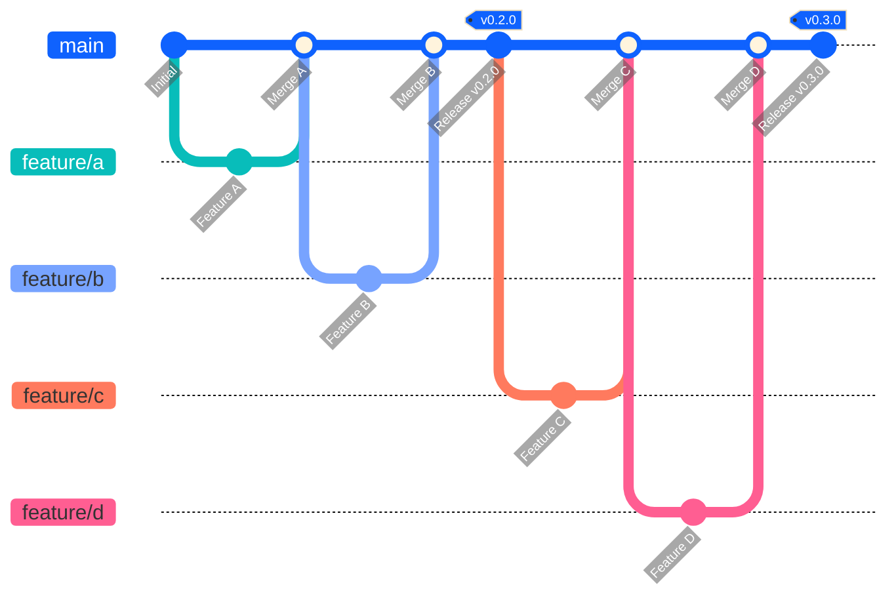
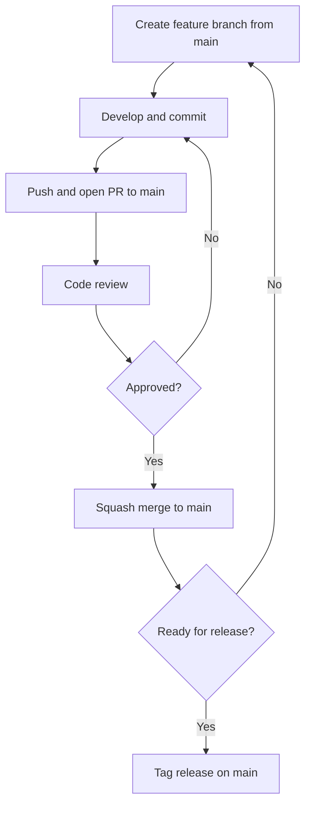

# Development Workflow

This document describes the development workflow for contributing to ai4rag.

---

## Branch Strategy

ai4rag uses a **single-branch workflow**:

- **`main`**: The default branch for all development
- **Feature branches**: Created from `main` for each change, merged back via PR

Maintainers create tagged releases directly from `main` when ready.



---

## Pull Request Workflow

### 1. Create a Feature Branch

All development starts from `main`:

```bash
# Ensure main is up to date
git checkout main
git pull origin main

# Create a feature branch
git checkout -b feature/your-feature-name
```

**Branch Naming Conventions:**

- `feature/` - New features (e.g., `feature/add-hybrid-retrieval`)
- `fix/` - Bug fixes (e.g., `fix/chunk-overlap-validation`)
- `docs/` - Documentation updates (e.g., `docs/improve-quickstart`)
- `refactor/` - Code refactoring (e.g., `refactor/search-space-validation`)
- `test/` - Test improvements (e.g., `test/add-chunking-tests`)

### 2. Make Changes

Develop your feature following our [code style guidelines](code-style.md):

```bash
# Make changes to files
# ...

# Run tests
uv run pytest

# Check code quality
uv run black ai4rag/
uv run pylint ai4rag/

# Commit with DCO sign-off
git commit -s -m "Add hybrid retrieval method

Implements hybrid retrieval combining dense and sparse search.

Signed-off-by: Your Name <your.email@example.com>"
```

!!! warning "Developer Certificate of Origin"
    All commits must include a sign-off (`git commit -s`) indicating acceptance of the [DCO](https://developercertificate.org/).

### 3. Push and Create PR

```bash
# Push your branch
git push origin feature/your-feature-name

# Create a PR on GitHub targeting the `main` branch
```

**PR Guidelines:**

- **Title**: Clear, concise description (e.g., "Add hybrid retrieval method")
- **Description**:
    - What: Summary of changes
    - Why: Motivation and context
    - How: Approach taken
    - Testing: How you verified it works
- **Link Issues**: Reference related issues (e.g., "Closes #123")
- **Request Reviews**: Tag relevant maintainers

### 4. Code Review Process

Maintainers will review your PR and may request changes:

```bash
# Make requested changes
# ...

# Commit and push updates
git commit -s -m "Address review comments"
git push origin feature/your-feature-name
```

**Review Requirements:**

- At least **1 LGTM** (Looks Good To Me) from maintainers
- All CI checks passing (tests, linters)
- No merge conflicts with `main`

### 5. PR Merge (Squash)

Once approved, maintainers will **squash and merge** your PR into `main`:

- All commits are squashed into a single commit
- Commit message is the PR title and description
- Feature branch is deleted after merge

```
feature/your-feature-name → main (squash merge)
```

!!! note "Why Squash?"
    Squashing keeps the `main` branch history clean with one commit per feature/fix, making it easier to track changes.

---

## Release Workflow

### Creating a Release

Releases are created by maintainers by tagging a commit on `main`:

```bash
# 1. Ensure main is up to date
git checkout main
git pull origin main

# 2. Run full test suite
uv run pytest

# 3. Update version in ai4rag/version.py
# Edit file: __version__ = "0.3.0"

# 4. Update CHANGELOG.md
# Add release notes

# 5. Commit version bump
git commit -s -m "Bump version to 0.3.0"
git push origin main

# 6. Tag the release
git tag -a v0.3.0 -m "Release version 0.3.0"

# 7. Push tag
git push origin v0.3.0

# 8. Create GitHub Release
# Use GitHub UI to create release from tag with changelog
```

**Release History:**

```
main branch:
  - Feature A (squashed PR)
  - Feature B (squashed PR)
  - Bug fix C (squashed PR)
  - Bump version to 0.2.0          ← tagged v0.2.0
  - Feature D (squashed PR)
  - Feature E (squashed PR)
  - Bump version to 0.3.0          ← tagged v0.3.0
```

---

## Workflow Summary



---

## Commit Message Guidelines

Follow the [Conventional Commits](https://www.conventionalcommits.org/) style:

```
<type>: <subject>

<body>

<footer>
```

**Types:**

- `feat`: New feature
- `fix`: Bug fix
- `docs`: Documentation changes
- `style`: Code style changes (formatting, no logic change)
- `refactor`: Code refactoring
- `test`: Adding or updating tests
- `chore`: Maintenance tasks

**Example:**

```
feat: add hybrid retrieval method

Implements a hybrid retrieval strategy combining dense vector
search and sparse keyword search for improved recall.

- Add HybridRetriever class
- Update search space to support hybrid mode
- Add tests for hybrid retrieval

Closes #42

Signed-off-by: John Doe <john.doe@example.com>
```

---

## CI/CD Pipeline

### Continuous Integration

On every PR to `main`: Coming soon...

### Continuous Deployment

On merge to `main`: Coming soon...

---

## Local Development Setup

### Initial Setup

This project uses [uv](https://docs.astral.sh/uv/) for dependency management. Install it first if you haven't already:

```bash
curl -LsSf https://astral.sh/uv/install.sh | sh
```

Then clone and set up the project:

```bash
# Clone repository
git clone https://github.com/IBM/ai4rag.git
cd ai4rag

# Install all development dependencies (creates .venv automatically)
uv sync --extra dev

# Set up pre-commit hooks (optional but recommended)
# pre-commit install
```

### Development Cycle

```bash
# 1. Create feature branch
git checkout main
git pull origin main
git checkout -b feature/my-feature

# 2. Make changes
# ... edit files ...

# 3. Format code
uv run black ai4rag/
uv run isort ai4rag/

# 4. Run linter
uv run pylint ai4rag/

# 5. Run tests
uv run pytest

# 6. Run tests with coverage
uv run pytest --cov=ai4rag --cov-report=html

# 7. Build docs locally
uv run mkdocs serve  # Visit http://127.0.0.1:8000

# 8. Commit with sign-off
git add .
git commit -s

# 9. Push and create PR
git push origin feature/my-feature
```

---

## Testing Requirements

All PRs must include tests:

- **Unit Tests**: For new functions/classes
- **Integration Tests**: For component interactions
- **Coverage**: Maintain or improve coverage (target: >80%)

```bash
# Run specific test file
uv run pytest tests/ai4rag/core/test_experiment.py

# Run with verbose output
uv run pytest -v

# Run with coverage report
uv run pytest --cov=ai4rag --cov-report=term-missing
```

See [Testing Guide](testing.md) for detailed testing practices.

---

## Documentation Requirements

PRs with new features must include documentation:

- **Docstrings**: All public classes and functions
- **User Guide**: Update relevant user guide pages
- **API Reference**: Auto-generated from docstrings
- **Examples**: Add examples for new features

```bash
# Build docs locally
uv run mkdocs serve

# Check for broken links
uv run mkdocs build --strict
```

---

## Version Numbering

ai4rag follows [Semantic Versioning](https://semver.org/):

- **Major** (X.0.0): Breaking changes
- **Minor** (0.X.0): New features, backward compatible
- **Patch** (0.0.X): Bug fixes, backward compatible

**Examples:**

- `0.1.0 → 0.2.0`: New feature added
- `0.2.0 → 0.2.1`: Bug fix
- `0.9.0 → 1.0.0`: Breaking API change

---

## Getting Help

- **Questions**: Open a [discussion](https://github.com/IBM/ai4rag/discussions)
- **Bugs**: Open an [issue](https://github.com/IBM/ai4rag/issues)

---

## Next Steps

- [Contributing Guide](contributing.md) - Detailed contribution guidelines
- [Testing Guide](testing.md) - Testing best practices
- [Code Style](code-style.md) - Code formatting and style rules
