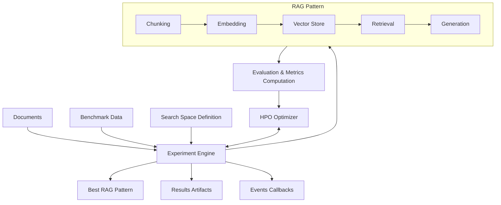

# ai4rag


## RAG Templates Optimization Engine

<div align="center">


</div>

<div align="center">


</div>

**ai4rag** is an optimization engine for RAG (Retrieval-Augmented Generation) patterns that is **LLM and Vector Database provider-agnostic**.
It accepts benchmark data, search space definition, optimizer configuration then returns a leaderboard with benchmarked RAG Template instances (called **RAG Patterns**).

---

## Key Features

- **Provider-agnostic**: Works with any LLM and vector database: for more information please see [Provider-agnostic section in User Guide](user-guide/provider-agnostic.md)
- **Hyperparameter Optimization**: Uses advanced HPO algorithms (GAM-based optimizer) to find optimal RAG configurations
- **Comprehensive Evaluation**: Built-in metrics for faithfulness, answer correctness, and context correctness
- **Flexible Search Space**: Define and constrain any RAG parameter (models, chunk sizes, retrieval methods, etc.)
- **Event-Driven Architecture**: Track experiment progress with custom event handlers
- **Production Ready**: Designed for real-world RAG optimization workflows

---

## Quick Example

```python
from ai4rag.core.experiment.experiment import AI4RAGExperiment
from ai4rag.core.hpo.gam_opt import GAMOptSettings
from ai4rag.rag.vector_store import ChromaConfig
from ai4rag.search_space.src.search_space import AI4RAGSearchSpace
from ai4rag.utils.event_handler import LocalEventHandler
from pathlib import Path

# Define search space
search_space = AI4RAGSearchSpace(params=[...])

# Configure optimizer
optimizer_settings = GAMOptSettings(max_evals=10, n_random_nodes=4)

# Run experiment
experiment = AI4RAGExperiment(
    documents=documents,
    benchmark_data=benchmark_data,
    search_space=search_space,
    vector_store_config=ChromaConfig(),
    optimizer_settings=optimizer_settings,
    event_handler=LocalEventHandler(
        output_path=Path(__file__).parent / "ai4rag_results"
    )
)

best_pattern = experiment.search()
```

---

## How It Works



1. **Documents and `benchmark_data.json`** are prepared following desired schema
2. **Search Space** defines possible parameter combinations (models, chunk sizes, retrieval methods, etc.)
3. **Optimizer** (optimization engine) explores configurations using an objective function with given RAG Template
4. **Evaluation** of each configuration using selected metrics based on the `Evaluator` (default `unitxt`)
5. **Results** are returned containing the optimal RAG Pattern with best performance

---

## What's Included

### Core Components

- **Experiment Engine**: Orchestrates the full optimization lifecycle
- **Hyperparameter Optimizer**: GAM-based optimization algorithm
- **Search Space**: Flexible parameter definition with validation rules
- **Evaluator**: metrics calculation (`faithfulness`, `answer_correctness`, `context_correctness`)

### RAG Components

- **Foundation Model**: LLM integration via `BaseFoundationModel` interface
- **Embedding Model**: embedding model integration via `BaseEmbeddingModel`
- **Vector Store**: Milvus, PostgreSQL/pgvector, or Chroma via direct clients — or bring your own via the `BaseVectorStore` interface
- **Chunking**: document splitting into smaller chunks
- **Retrieval**: simple and window-based retrieval strategies
- **Templates**: complete RAG implementations defined as a `RAGTemplate`

---

## Requirements

!!! warning "OpenShift MaaS Integration"
    `ai4rag` works with an [OpenShift AI Models-as-a-Service (MaaS)](https://www.redhat.com/en/products/ai) deployment as its foundation model and embedding model provider, accessed through the stock [`openai`](https://github.com/openai/openai-python) SDK.
    To run an experiment against MaaS you will need:

    - At least one foundation model (for text generation)
    - At least one embedding model (for document embeddings)

    The vector store is independent of MaaS: connect directly to Chroma, Milvus, or PostgreSQL/pgvector via `ChromaConfig`, `MilvusConfig`, or `PGVectorConfig`.

---

## Getting Started

<div class="grid cards" markdown>

-   :material-clock-fast:{ .lg .middle } __Installation__

    ---

    Install ai4rag with pip and set up your environment

    [:octicons-arrow-right-24: Installation Guide](getting-started/installation.md)

-   :material-rocket-launch:{ .lg .middle } __Quick Start__

    ---

    Run your first RAG optimization in minutes

    [:octicons-arrow-right-24: Quick Start](getting-started/quick-start.md)

-   :material-book-open-variant:{ .lg .middle } __User Guide__

    ---

    Deep dive into search spaces, optimizers, and evaluation

    [:octicons-arrow-right-24: User Guide](user-guide/overview.md)

-   :material-code-braces:{ .lg .middle } __API Reference__

    ---

    Complete API documentation for all components

    [:octicons-arrow-right-24: API Reference](api-reference/core/experiment.md)

</div>

---

## Community and Support

- **GitHub Repository**: [IBM/ai4rag](https://github.com/IBM/ai4rag)
- **Issue Tracker**: [Report bugs or request features](https://github.com/IBM/ai4rag/issues)
- **Contributing**: See our [contribution guidelines](development/contributing.md)

---

## License

`ai4rag` is released under the Apache License 2.0. See [LICENSE](about/license.md) for details.

Copyright © 2025-2026 IBM Corp.
