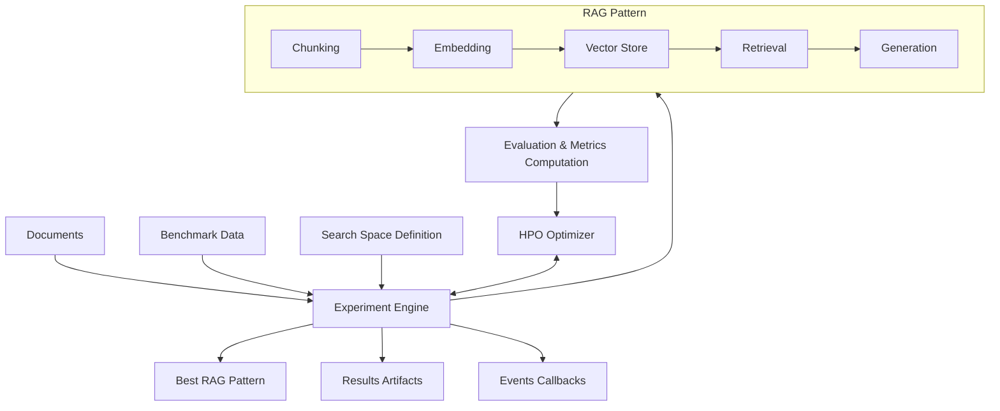

# ai4RAG

!!! note "This documentation is currently under construction ⚙️⏳..."

## RAG Templates Optimization Engine

<div align="center">


</div>

<div align="center">


</div>

**ai4RAG** is an optimization engine for RAG (Retrieval-Augmented Generation) Templates that is **LLM and Vector Database provider agnostic**. It accepts RAG Templates and search space definitions, then returns an initialized RAG Template with optimal parameter values (called a **RAG Pattern**).

---

## Key Features

- **Provider Agnostic**: Works with any LLM and vector database through Llama Stack integration
- **Hyperparameter Optimization**: Uses advanced HPO algorithms (GAM-based, Random) to find optimal RAG configurations
- **Comprehensive Evaluation**: Built-in metrics for faithfulness, answer correctness, and context correctness
- **Flexible Search Space**: Define and constrain any RAG parameter (models, chunk sizes, retrieval methods, etc.)
- **Event-Driven Architecture**: Track experiment progress with custom event handlers
- **Production Ready**: Designed for real-world RAG optimization workflows

---

## Quick Example

```python
from ai4rag.core.experiment.experiment import AI4RAGExperiment
from ai4rag.search_space.src.search_space import AI4RAGSearchSpace
from ai4rag.core.hpo.gam_opt import GAMOptSettings

# Define search space
search_space = AI4RAGSearchSpace(params=[...])

# Configure optimizer
optimizer_settings = GAMOptSettings(max_evals=10, n_random_nodes=4)

# Run experiment
experiment = AI4RAGExperiment(
    client=llama_stack_client,
    documents=documents,
    benchmark_data=benchmark_data,
    search_space=search_space,
    vector_store_type="ls_milvus",
    optimizer_settings=optimizer_settings,
)

best_pattern = experiment.search()
```

---

## How It Works



1. **Indexing Phase**: Documents are chunked, embedded, and stored in a vector database
2. **Search Space**: Define possible parameter combinations (models, chunk sizes, retrieval methods)
3. **Optimization**: HPO engine explores configurations using an objective function
4. **Evaluation**: Each configuration is evaluated using unitxt metrics
5. **Result**: Return the optimal RAG Pattern with best performance

---

## What's Included

### Core Components

- **Experiment Engine**: Orchestrates the full optimization lifecycle
- **HPO Optimizers**: GAM-based and Random search algorithms
- **Search Space**: Flexible parameter definition with validation rules
- **Evaluator**: Unitxt-based metrics (faithfulness, correctness)

### RAG Components

- **Foundation Models**: LLM integration via Llama Stack
- **Embedding Models**: Text embedding generation
- **Vector Stores**: Milvus and ChromaDB support
- **Chunking**: LangChain-based document splitting
- **Retrieval**: Simple and window-based retrieval strategies
- **Templates**: Complete RAG implementations

---

## Requirements

!!! warning "Llama Stack Integration"
    At this moment ai4rag is designed to work with a [Llama Stack](https://github.com/llamastack/llama-stack) server. You need:

    - At least one foundation model (for text generation)
    - At least one embedding model (for document embeddings)
    - Vector database configured (e.g., Milvus) or locally used instance of Chroma

---

## Getting Started

<div class="grid cards" markdown>

-   :material-clock-fast:{ .lg .middle } __Installation__

    ---

    Install ai4rag with pip and set up your environment

    [:octicons-arrow-right-24: Installation Guide](getting-started/installation.md)

-   :material-rocket-launch:{ .lg .middle } __Quick Start__

    ---

    Run your first RAG optimization in minutes

    [:octicons-arrow-right-24: Quick Start](getting-started/quick-start.md)

-   :material-book-open-variant:{ .lg .middle } __User Guide__

    ---

    Deep dive into search spaces, optimizers, and evaluation

    [:octicons-arrow-right-24: User Guide](user-guide/overview.md)

-   :material-code-braces:{ .lg .middle } __API Reference__

    ---

    Complete API documentation for all components

    [:octicons-arrow-right-24: API Reference](api-reference/core/experiment.md)

</div>

---

## Community and Support

- **GitHub Repository**: [IBM/ai4rag](https://github.com/IBM/ai4rag)
- **Issue Tracker**: [Report bugs or request features](https://github.com/IBM/ai4rag/issues)
- **Contributing**: See our [contribution guidelines](development/contributing.md)

---

## License

ai4rag is released under the Apache License 2.0. See [LICENSE](about/license.md) for details.

Copyright © 2025-2026 IBM Corp.
