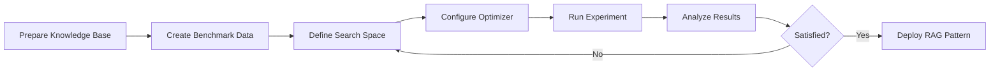

# User Guide Overview

Welcome to the ai4rag user guide. This section provides comprehensive documentation for using ai4rag to optimize your RAG configurations.

---

## What You'll Learn

This user guide covers:

1. **[Search Space](search-space.md)**: How to define and constrain parameter search spaces
2. **[Optimizers](optimizers.md)**: Understanding HPO algorithms and their configuration
3. **[Evaluation](evaluation.md)**: Metrics, scoring, and result interpretation
4. **[Event Handlers](event-handlers.md)**: Tracking and monitoring experiments

---

## Core Concepts

### RAG Template vs RAG Pattern

- **RAG Template**: A RAG implementation with parameter placeholders
- **RAG Pattern**: A RAG implementation with optimal parameter values (the output)

ai4rag transforms templates into patterns through optimization.

### Search Space

The **search space** defines all possible parameter combinations:

```python
from ai4rag.search_space.src.search_space import AI4RAGSearchSpace
from ai4rag.search_space.src.parameter import Parameter

search_space = AI4RAGSearchSpace(
    params=[
        Parameter(name="chunk_size", param_type="I", values=[200, 400, 800]),
        Parameter(name="retrieval_method", param_type="C", values=["simple", "window"]),
    ]
)
```

### Hyperparameter Optimization

The **HPO engine** explores the search space intelligently:

1. Sample configurations from the search space
2. Evaluate each configuration using benchmark data
3. Use results to guide future sampling
4. Return the best-performing configuration

### Evaluation Metrics

ai4rag uses **multiple evaluator types** for comprehensive quality assessment:

- **Faithfulness** (Unitxt): Answer grounded in retrieved context
- **Answer Correctness** (Unitxt): Answer matches ground truth
- **Context Correctness** (Unitxt): Retrieved documents are relevant
- **Answer Relevance** (LLM Judge): Response directly addresses the question
- **Overall Score** (Custom): Mean of all other metrics (default optimization target)

---

## Typical Workflow



1. **Prepare**: Gather documents and create benchmark questions
2. **Define**: Specify search space and constraints
3. **Optimize**: Run experiment with chosen HPO algorithm
4. **Analyze**: Review results and metrics
5. **Iterate**: Refine search space if needed
6. **Deploy**: Use the best RAG pattern in production

---

## Next Steps

Start with the most relevant topic for your needs:

- **New to ai4rag?** Begin with [Search Space](search-space.md)
- **Optimizing performance?** Check [Optimizers](optimizers.md)
- **Understanding results?** Read [Evaluation](evaluation.md)
- **Production deployment?** See [Event Handlers](event-handlers.md)
